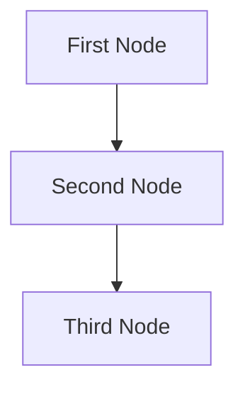

# Chat with The-Pocket/PocketFlow

## You

if you were to start again how would you tell the developer to build your project step by step?

## AI

Okay, if we were starting a project together using PocketFlow and the Agentic Coding approach, here's how I would guide you, the human developer, through the steps:

## Agentic Coding Steps

We'll work together, with you focusing on the high-level design and requirements, and me assisting with the detailed design and implementation. Here's the breakdown:

1.  **Define Requirements:**
    *   **Your Role (High):** You start by clearly defining the project requirements. What problem are we solving? What should the system do from the user's perspective? What are the key features?
    *   **My Role (Low):** I listen and help clarify any ambiguities in the requirements.

2.  **Design the Flow:**
    *   **Your Role (Medium):** You outline the high-level flow of the application. Think about the sequence of operations and identify applicable design patterns like RAG, Map Reduce, or Agent workflows. You can describe the flow using a simple list or even a diagram (like a mermaid diagram).
    *   **My Role (Medium):** I help fill in details, suggest how the patterns fit, and refine the flow based on the requirements.

3.  **Identify Utilities:**
    *   **Your Role (Medium):** You identify any external APIs, databases, or custom functions (utilities) the system will need to interact with.
    *   **My Role (Medium):** I help identify necessary utilities based on the flow and assist in defining their interfaces.

4.  **Design the Nodes:**
    *   **Your Role (Low):** You provide high-level guidance on how data should be managed (e.g., using a shared store). You can specify the type of each node (Regular, Batch, Async).
    *   **My Role (High):** Based on the flow and utilities, I design the individual nodes. This involves defining how each node will read data from the shared store (`prep`), what utility function it will use (`exec`), and how it will write its results back to the shared store (`post`).

5.  **Implement the Flow:**
    *   **Your Role (Low):** You oversee the process and provide feedback.
    *   **My Role (High):** I implement the nodes and connect them according to the designed flow. I'll start simple, avoid complex error handling initially (FAIL FAST!), and add logging to make debugging easier.

6.  **Optimize and Iterate:**
    *   **Your Role:** You provide intuition and evaluate the system's performance and output.
    *   **My Role:** I help identify bottlenecks, suggest redesigns (going back to Step 2 if needed), and apply micro-optimizations like prompt engineering or in-context learning.
    *   **Together:** This is an iterative process. We will likely repeat steps 3-6 multiple times to refine the system until it meets the requirements effectively.

Remember to always start with the simplest possible solution and design at a high level before diving into implementation details. Communication and feedback are key!

### Assistant's Reasoning

The user is asking for a step-by-step guide on how to build a project using PocketFlow, specifically from the perspective of the AI assistant telling the developer (human) how to proceed. The provided context, particularly `docs/guide.md`, details the 'Agentic Coding Steps' which define the collaboration between humans and AI in building LLM systems with PocketFlow. I will use these steps to outline the process for the developer.

### Source Code References

#### 1. cookbook/data/PaulGrahamEssaysLarge/before.txt

```txt
a cool office and hire a bunch of people is: gradually
realize how completely fucked they are, because while imitating all
the outward forms of a startup they have neglected the one thing
that's actually essential: making something people want.
GameWe saw this happen so often that we made up a name for it: playing
house.  Eventually I realized why it was happening.  The reason
young founders go through the motions of starting a startup is
because that's what they've been trained to do for their whole lives
up to that point.  Think about what you have to do to get into
college, for example.  Extracurricular activities, check.  Even in
college classes most of the work is as artificial as running laps.I'm not attacking the educational system for being this way. There
will always be a certain amount of fakeness in the work you do when
you're being taught something, and if you measure their performance
it's inevitable that people will exploit the difference to the point
where much of what you're measuring is artifacts of the fakeness.I confess I did it myself in college. I found that in a lot of
classes there might only be 20 or 30 ideas that were the right shape
to make good exam questions.  The way I studied for exams in these
classes was not (except incidentally) to master the material taught
in the class, but to make a list of potential exam questions and
work out the answers in advance. When I walked into the final, the
main thing I'd be feeling was curiosity about which of my questions
would turn up on the exam.  It was like a game.It's not surprising that after being trained for their whole lives
to play such games, young founders' first impulse on starting a
startup is to try to figure out the tricks for winning at this new
game. Since fundraising appears to be the measure of success for
startups (another classic noob mistake), they always want to know what the
tricks are for convincing investors.  We tell them the best way to
convince investors is to make a startup
that's actually doing well, meaning growing fast, and then simply
tell investors so.  Then they 
```

#### 2. cookbook/data/PaulGrahamEssaysLarge/avg.txt

```txt
course.
If you do everything the way the average startup does it, you should
expect average performance.  The problem here is, average performance
means that you'll go out of business.  The survival rate for startups
is way less than fifty percent.  So if you're running a startup,
you had better be doing something odd.  If not, you're in trouble.Back in 1995, we knew something that I don't think our competitors
understood, and few understand even now:  when you're writing
software that only has to run on your own servers, you can use
any language you want.  When you're writing desktop software,
there's a strong bias toward writing applications in the same
language as the operating system.  Ten years ago, writing applications
meant writing applications in C.  But with Web-based software,
especially when you have the source code of both the language and
the operating system, you can use whatever language you want.This new freedom is a double-edged sword, however.  Now that you
can use any language, you have to think about which one to use.
Companies that try to pretend nothing has changed risk finding that
their competitors do not.If you can use any language, which do you use?  We chose Lisp.
For one thing, it was obvious that rapid development would be
important in this market.  We were all starting from scratch, so
a company that could get new features done before its competitors
would have a big advantage.  We knew Lisp was a really good language
for writing software quickly, and server-based applications magnify
the effect of rapid development, because you can release software
the minute it's done.If other companies didn't want to use Lisp, so much the better.
It might give us a technological edge, and we needed all the help
we could get.  When we started Viaweb, we had no experience in
business.  We didn't know anything about marketing, or hiring
people, or raising money, or getting customers.  Neither of us had
ever even had what you would call a real job.  The only thing we
were good at was writing software.  We hoped that would save us.
Any advantage we could get in the software department, we would
take.So 
```

#### 3. cookbook/data/PaulGrahamEssaysLarge/before.txt

```txt
of my questions
would turn up on the exam.  It was like a game.It's not surprising that after being trained for their whole lives
to play such games, young founders' first impulse on starting a
startup is to try to figure out the tricks for winning at this new
game. Since fundraising appears to be the measure of success for
startups (another classic noob mistake), they always want to know what the
tricks are for convincing investors.  We tell them the best way to
convince investors is to make a startup
that's actually doing well, meaning growing fast, and then simply
tell investors so.  Then they want to know what the tricks are for
growing fast.  And we have to tell them the best way to do that is
simply to make something people want.So many of the conversations YC partners have with young founders
begin with the founder asking "How do we..." and the partner replying
"Just..."Why do the founders always make things so complicated?  The reason,
I realized, is that they're looking for the trick.So this is the third counterintuitive thing to remember about
startups: starting a startup is where gaming the system stops
working.  Gaming the system may continue to work if you go to work
for a big company. Depending on how broken the company is, you can
succeed by sucking up to the right people, giving the impression
of productivity, and so on. 
[2]
But that doesn't work with startups.
There is no boss to trick, only users, and all users care about is
whether your product does what they want. Startups are as impersonal
as physics.  You have to make something people want, and you prosper
only to the extent you do.The dangerous thing is, faking does work to some degree on investors.
If you're super good at sounding like you know what you're talking
about, you can fool investors for at least one and perhaps even two
rounds of funding.  But it's not in your interest to.  The company
is ultimately doomed.  All you're doing is wasting your own time
riding it down.So stop looking for the trick. There are tricks in startups, as
there are in any domain, but they are an 
```

#### 4. cookbook/data/PaulGrahamEssaysLarge/before.txt

```txt


Want to start a startup?  Get funded by
Y Combinator.


October 2014(This essay is derived from a guest lecture in Sam Altman's startup class at
Stanford.  It's intended for college students, but much of it is
applicable to potential founders at other ages.)One of the advantages of having kids is that when you have to give
advice, you can ask yourself "what would I tell my own kids?"  My
kids are little, but I can imagine what I'd tell them about startups
if they were in college, and that's what I'm going to tell you.Startups are very counterintuitive.  I'm not sure why.  Maybe it's
just because knowledge about them hasn't permeated our culture yet.
But whatever the reason, starting a startup is a task where you
can't always trust your instincts.It's like skiing in that way.  When you first try skiing and you
want to slow down, your instinct is to lean back.  But if you lean
back on skis you fly down the hill out of control.  So part of
learning to ski is learning to suppress that impulse.  Eventually
you get new habits, but at first it takes a conscious effort.  At
first there's a list of things you're trying to remember as you
start down the hill.Startups are as unnatural as skiing, so there's a similar list for
startups. Here I'm going to give you the first part of it — the things
to remember if you want to prepare yourself to start a startup.
CounterintuitiveThe first item on it is the fact I already mentioned: that startups
are so weird that if you trust your instincts, you'll make a lot
of mistakes.  If you know nothing more than this, you may at least
pause before making them.When I was running Y Combinator I used to joke that our function
was to tell founders things they would ignore.  It's really true.
Batch after batch, the YC partners warn founders about mistakes
they're about to make, and the founders ignore them, and then come
back a year later and say "I wish we'd listened."Why do the founders ignore the partners' advice?  Well, that's the
thing about counterintuitive ideas: they contradict your intuitions.
They 
```

#### 5. cookbook/pocketflow-batch/translations/README_FRENCH.md

```md
pour débutants ? [Créez une issue!](https://github.com/The-Pocket/PocketFlow/issues/new)

## Comment utiliser Pocket Flow ?

🚀 Grâce à la **Programmation Agentique**—le paradigme de développement d'applications LLM le plus rapide—où *les humains conçoivent* et *les agents codent* !

<br>
<div align="center">
  <a href="https://zacharyhuang.substack.com/p/agentic-coding-the-most-fun-way-to" target="_blank">
    
  </a>
</div>
<br>

✨ Voici des exemples d'applications LLM plus complexes :

<div align="center">
  
|  Nom de l'application     |  Difficulté    | Sujets  | Conception Humaine | Code Agent |
| :-------------:  | :-------------: | :---------------------: |  :---: |  :---: |
| [Construire Cursor avec Cursor](https://github.com/The-Pocket/Tutorial-Cursor) <br> <sup><sub>Nous atteindrons bientôt la singularité ...</sup></sub> | ★★★ <br> *Avancé*   | [Agent](https://the-pocket.github.io/PocketFlow/design_pattern/agent.html) | [Document de conception](https://github.com/The-Pocket/Tutorial-Cursor/blob/main/docs/design.md) | [Code Flow](https://github.com/The-Pocket/Tutorial-Cursor/blob/main/flow.py)
| [Demandez à l'IA Paul Graham](https://github.com/The-Pocket/Tutorial-YC-Partner) <br> <sup><sub>Demandez à l'IA Paul Graham, au cas où vous n'êtes pas accepté</sup></sub> | ★★☆ <br> *Moyen*   | [RAG](https://the-pocket.github.io/PocketFlow/design_pattern/rag.html) <br> [Map Reduce](https://the-pocket.github.io/PocketFlow/design_pattern/mapreduce.html) <br> [TTS](https://the-pocket.github.io/PocketFlow/utility_function/text_to_speech.html) | [Document de conception](https://github.com/The-Pocket/Tutorial-AI-Paul-Graham/blob/main/docs/design.md) | [Code Flow](https://github.com/The-Pocket/Tutorial-AI-Paul-Graham/blob/main/flow.py)
| [Résumeur Youtube](https://github.com/The-Pocket/Tutorial-Youtube-Made-Simple)  <br> <sup><sub> Explique les vidéos YouTube comme si vous aviez 5 ans </sup></sub> | ★☆☆ <br> *Intermédiaire*   | [Map Reduce](https://the-pocket.github.io/PocketFlow/design_pattern/mapreduce.html) |  [Document de conception](https://github.com/The-Pocket/Tutorial-Youtube-Made-Simple/blob/main/docs/design.md) | [Code Flow](https://github.com/The-Pocket/Tutorial-Youtube-Made-Simple/blob/main/flow.py)
| [Générateur d'Introduction](https://github.com/The-Pocket/Tutorial-Cold-Email-Personalization)  <br> <sup><sub> Des brise-glaces instantanés qui transforment les prospects froids en prospects chauds </sup></sub> | ★☆☆ <br> *Intermédiaire*   | [Map Reduce](https://the-pocket.github.io/PocketFlow/design_pattern/mapreduce.html) <br> [Recherche Web](https://the-pocket.github.io/PocketFlow/utility_function/websearch.html) |  [Document de conception](https://github.com/The-Pocket/Tutorial-Cold-Email-Personalization/blob/master/docs/design.md) | [Code Flow](https://github.com/The-Pocket/Tutorial-Cold-Email-Personalization/blob/master/flow.py)

</div>

- Vous voulez apprendre la **Programmation Agentique** ?

  - Consultez [ma chaîne YouTube](https://www.youtube.com/@ZacharyLLM?sub_confirmation=1) pour des tutoriels vidéo sur la façon dont certaines applications ci-dessus sont créées !

  - Vous souhaitez créer votre propre application LLM ? Lisez cet [article](https://zacharyhuang.substack.com/p/agentic-coding-the-most-fun-way-to) ! Commencez avec [ce modèle](https://github.com/The-Pocket/PocketFlow-Template-Python) !

  - Vous voulez apprendre les étapes détaillées ? Lisez ce [Guide](https://the-pocket.github.io/PocketFlow/guide.html) !
```

#### 6. docs/guide.md

```md
      "location": "San Francisco"
                }
            },
            "results": {}                   # Empty dict to store outputs
        }
        ```
   - For each [Node](./core_abstraction/node.md), describe its type, how it reads and writes data, and which utility function it uses. Keep it specific but high-level without codes. For example:
     - `type`: Regular (or Batch, or Async)
     - `prep`: Read "text" from the shared store
     - `exec`: Call the embedding utility function
     - `post`: Write "embedding" to the shared store

5. **Implementation**: Implement the initial nodes and flows based on the design.
   - 🎉 If you've reached this step, humans have finished the design. Now *Agentic Coding* begins!
   - **"Keep it simple, stupid!"** Avoid complex features and full-scale type checking.
   - **FAIL FAST**! Avoid `try` logic so you can quickly identify any weak points in the system.
   - Add logging throughout the code to facilitate debugging.

7. **Optimization**:
   - **Use Intuition**: For a quick initial evaluation, human intuition is often a good start.
   - **Redesign Flow (Back to Step 3)**: Consider breaking down tasks further, introducing agentic decisions, or better managing input contexts.
   - If your flow design is already solid, move on to micro-optimizations:
     - **Prompt Engineering**: Use clear, specific instructions with examples to reduce ambiguity.
     - **In-Context Learning**: Provide robust examples for tasks that are difficult to specify with instructions alone.

   - > **You'll likely iterate a lot!** Expect to repeat Steps 3–6 hundreds of times.
     
```

#### 7. cookbook/pocketflow-batch/translations/README_GERMAN.md

```md
[Frag KI Paul Graham](https://github.com/The-Pocket/Tutorial-YC-Partner) <br> <sup><sub>Frag KI Paul Graham, falls du nicht reinkommst</sup></sub> | ★★☆ <br> *Mittel*   | [RAG](https://the-pocket.github.io/PocketFlow/design_pattern/rag.html) <br> [Map Reduce](https://the-pocket.github.io/PocketFlow/design_pattern/mapreduce.html) <br> [TTS](https://the-pocket.github.io/PocketFlow/utility_function/text_to_speech.html) | [Design-Dokument](https://github.com/The-Pocket/Tutorial-AI-Paul-Graham/blob/main/docs/design.md) | [Flow-Code](https://github.com/The-Pocket/Tutorial-AI-Paul-Graham/blob/main/flow.py)
| [Youtube-Zusammenfasser](https://github.com/The-Pocket/Tutorial-Youtube-Made-Simple)  <br> <sup><sub> Erklärt dir YouTube-Videos, als wärst du 5 </sup></sub> | ★☆☆ <br> *Anfänger*   | [Map Reduce](https://the-pocket.github.io/PocketFlow/design_pattern/mapreduce.html) |  [Design-Dokument](https://github.com/The-Pocket/Tutorial-Youtube-Made-Simple/blob/main/docs/design.md) | [Flow-Code](https://github.com/The-Pocket/Tutorial-Youtube-Made-Simple/blob/main/flow.py)
| [Kaltakquise-Generator](https://github.com/The-Pocket/Tutorial-Cold-Email-Personalization)  <br> <sup><sub> Sofortige Eisbrecher, die kalte Leads heiß machen </sup></sub> | ★☆☆ <br> *Anfänger*   | [Map Reduce](https://the-pocket.github.io/PocketFlow/design_pattern/mapreduce.html) <br> [Web-Suche](https://the-pocket.github.io/PocketFlow/utility_function/websearch.html) |  [Design-Dokument](https://github.com/The-Pocket/Tutorial-Cold-Email-Personalization/blob/master/docs/design.md) | [Flow-Code](https://github.com/The-Pocket/Tutorial-Cold-Email-Personalization/blob/master/flow.py)

</div>

- Willst du **Agentisches Programmieren** lernen?

  - Schau dir [meinen YouTube-Kanal](https://www.youtube.com/@ZacharyLLM?sub_confirmation=1) für Video-Tutorials an, wie einige der obigen Apps erstellt wurden!

  - Willst du deine eigene LLM-App bauen? Lies diesen [Beitrag](https://zacharyhuang.substack.com/p/agentic-coding-the-most-fun-way-to)! Beginne mit [dieser Vorlage](https://github.com/The-Pocket/PocketFlow-Template-Python)!

  - Willst du die detaillierten Schritte lernen? Lies diesen [Leitfaden](https://the-pocket.github.io/PocketFlow/guide.html)!
```

#### 8. cookbook/data/PaulGrahamEssaysLarge/before.txt

```txt
you
have misgivings about them, trust your gut.  If someone seems
slippery, or bogus, or a jerk, don't ignore it.This is one case where it pays to be self-indulgent. Work with
people you genuinely like, and you've known long enough to be sure.
ExpertiseThe second counterintuitive point is that it's not that important
to know a lot about startups.  The way to succeed in a startup is
not to be an expert on startups, but to be an expert on your users
and the problem you're solving for them.
Mark Zuckerberg didn't succeed because he was an expert on startups.
He succeeded despite being a complete noob at startups, because he
understood his users really well.If you don't know anything about, say, how to raise an angel round,
don't feel bad on that account.  That sort of thing you can learn
when you need to, and forget after you've done it.In fact, I worry it's not merely unnecessary to learn in great
detail about the mechanics of startups, but possibly somewhat
dangerous.  If I met an undergrad who knew all about convertible
notes and employee agreements and (God forbid) class FF stock, I
wouldn't think "here is someone who is way ahead of their peers."
It would set off alarms.  Because another of the characteristic
mistakes of young founders is to go through the motions of starting
a startup.  They make up some plausible-sounding idea, raise money
at a good valuation, rent a cool office, hire a bunch of people.
From the outside that seems like what startups do.  But the next
step after rent a cool office and hire a bunch of people is: gradually
realize how completely fucked they are, because while imitating all
the outward forms of a startup they have neglected the one thing
that's actually essential: making something people want.
GameWe saw this happen so often that we made up a name for it: playing
house.  Eventually I realized why it was happening.  The reason
young founders go through the motions of starting a startup is
because that's what they've been trained to do for their whole lives
up to that point.  Think about what you have to do to get into
college, for example.  
```

#### 9. cookbook/data/PaulGrahamEssaysLarge/avg.txt

```txt
development, because you can release software
the minute it's done.If other companies didn't want to use Lisp, so much the better.
It might give us a technological edge, and we needed all the help
we could get.  When we started Viaweb, we had no experience in
business.  We didn't know anything about marketing, or hiring
people, or raising money, or getting customers.  Neither of us had
ever even had what you would call a real job.  The only thing we
were good at was writing software.  We hoped that would save us.
Any advantage we could get in the software department, we would
take.So you could say that using Lisp was an experiment.  Our hypothesis
was that if we wrote our software in Lisp, we'd be able to get
features done faster than our competitors, and also to do things
in our software that they couldn't do.  And because Lisp was so
high-level, we wouldn't need a big development team, so our costs
would be lower.  If this were so, we could offer a better product
for less money, and still make a profit.  We would end up getting
all the users, and our competitors would get none, and eventually
go out of business.  That was what we hoped would happen, anyway.What were the results of this experiment?  Somewhat surprisingly,
it worked.  We eventually had many competitors, on the order of
twenty to thirty of them, but none of their software could compete
with ours.  We had a wysiwyg online store builder that ran on the
server and yet felt like a desktop application.  Our competitors
had cgi scripts.  And we were always far ahead of them in features.
Sometimes, in desperation, competitors would try to introduce
features that we didn't have.  But with Lisp our development cycle
was so fast that we could sometimes duplicate a new feature within
a day or two of a competitor announcing it in a press release.  By
the time journalists covering the press release got round to calling
us, we would have the new feature too.It must have seemed to our competitors that we had some kind of
secret weapon-- that we were decoding their 
```

#### 10. docs/guide.md

```md
---
layout: default
title: "Agentic Coding"
---

# Agentic Coding: Humans Design, Agents code!

> If you are an AI agents involved in building LLM Systems, read this guide **VERY, VERY** carefully! This is the most important chapter in the entire document. Throughout development, you should always (1) start with a small and simple solution, (2) design at a high level (`docs/design.md`) before implementation, and (3) frequently ask humans for feedback and clarification.
{: .warning }

## Agentic Coding Steps

Agentic Coding should be a collaboration between Human System Design and Agent Implementation:

| Steps                  | Human      | AI        | Comment                                                                 |
|:-----------------------|:----------:|:---------:|:------------------------------------------------------------------------|
| 1. Requirements | ★★★ High  | ★☆☆ Low   | Humans understand the requirements and context.                    |
| 2. Flow          | ★★☆ Medium | ★★☆ Medium |  Humans specify the high-level design, and the AI fills in the details. |
| 3. Utilities   | ★★☆ Medium | ★★☆ Medium | Humans provide available external APIs and integrations, and the AI helps with implementation. |
| 4. Node          | ★☆☆ Low   | ★★★ High  | The AI helps design the node types and data handling based on the flow.          |
| 5. Implementation      | ★☆☆ Low   | ★★★ High  |  The AI implements the flow based 
```

#### 11. cookbook/data/PaulGrahamEssaysLarge/aord.txt

```txt
October 2015When I talk to a startup that's been operating for more than 8 or
9 months, the first thing I want to know is almost always the same.
Assuming their expenses remain constant and their revenue growth
is what it has been over the last several months, do they make it to
profitability on the money they have left?  Or to put it more
dramatically, by default do they live or die?The startling thing is how often the founders themselves don't know.
Half the founders I talk to don't know whether they're default alive
or default dead.If you're among that number, Trevor Blackwell has made a handy
calculator you can use to find out.The reason I want to know first whether a startup is default alive
or default dead is that the rest of the conversation depends on the
answer.  If the company is default alive, we can talk about ambitious
new things they could do.  If it's default dead, we probably need
to talk about how to save it.  We know the current trajectory ends
badly.  How can they get off that trajectory?Why do so few founders know whether they're default alive or default
dead?  Mainly, I think, because they're not used to asking that.
It's not a question that makes sense to ask early on, any more than
it makes sense to ask a 3 year old how he plans to support
himself.  But as the company grows older, the question switches from
meaningless to critical.  That kind of switch often takes people
by surprise.I propose the following solution: instead of starting to ask too
late whether you're default alive or default dead, start asking too
early.  It's hard to say precisely when the question switches
polarity.  But it's probably not that dangerous to start worrying
too early that you're default dead, whereas it's very dangerous to
start worrying too late.The reason is a phenomenon I wrote about earlier: the
fatal pinch.
The fatal pinch is default dead + slow growth + not enough
time to fix it.  And the way founders end up in it is by not realizing
that's where they're headed.There is another reason founders don't ask themselves whether they're
default alive 
```

#### 12. README.md

```md
complex LLM Apps:

<div align="center">
  
|  App Name     |  Difficulty    | Topics  | Human Design | Agent Code |
| :-------------:  | :-------------: | :---------------------: |  :---: |  :---: |
| [Build Cursor with Cursor](https://github.com/The-Pocket/Tutorial-Cursor) <br> <sup><sub>We'll reach the singularity soon ...</sup></sub> | ★★★ <br> *Advanced*   | [Agent](https://the-pocket.github.io/PocketFlow/design_pattern/agent.html) | [Design Doc](https://github.com/The-Pocket/Tutorial-Cursor/blob/main/docs/design.md) | [Flow Code](https://github.com/The-Pocket/Tutorial-Cursor/blob/main/flow.py)
| [Ask AI Paul Graham](https://github.com/The-Pocket/Tutorial-YC-Partner) <br> <sup><sub>Ask AI Paul Graham, in case you don't get in</sup></sub> | ★★☆ <br> *Medium*   | [RAG](https://the-pocket.github.io/PocketFlow/design_pattern/rag.html) <br> [Map Reduce](https://the-pocket.github.io/PocketFlow/design_pattern/mapreduce.html) <br> [TTS](https://the-pocket.github.io/PocketFlow/utility_function/text_to_speech.html) | [Design Doc](https://github.com/The-Pocket/Tutorial-AI-Paul-Graham/blob/main/docs/design.md) | [Flow Code](https://github.com/The-Pocket/Tutorial-AI-Paul-Graham/blob/main/flow.py)
| [Youtube Summarizer](https://github.com/The-Pocket/Tutorial-Youtube-Made-Simple)  <br> <sup><sub> Explain YouTube Videos to you like you're 5 </sup></sub> | ★☆☆ <br> *Beginner*   | [Map Reduce](https://the-pocket.github.io/PocketFlow/design_pattern/mapreduce.html) |  [Design Doc](https://github.com/The-Pocket/Tutorial-Youtube-Made-Simple/blob/main/docs/design.md) | [Flow Code](https://github.com/The-Pocket/Tutorial-Youtube-Made-Simple/blob/main/flow.py)
| [Cold Opener Generator](https://github.com/The-Pocket/Tutorial-Cold-Email-Personalization)  <br> <sup><sub> Instant icebreakers that turn cold leads hot </sup></sub> | ★☆☆ <br> *Beginner*   | [Map Reduce](https://the-pocket.github.io/PocketFlow/design_pattern/mapreduce.html) <br> [Web Search](https://the-pocket.github.io/PocketFlow/utility_function/websearch.html) |  [Design Doc](https://github.com/The-Pocket/Tutorial-Cold-Email-Personalization/blob/master/docs/design.md) | [Flow Code](https://github.com/The-Pocket/Tutorial-Cold-Email-Personalization/blob/master/flow.py)

</div>

- Want to learn **Agentic Coding**?

  - Check out [my YouTube](https://www.youtube.com/@ZacharyLLM?sub_confirmation=1) for video tutorial on how some apps above are made!

  - Want to build your own LLM App? Read this [post](https://zacharyhuang.substack.com/p/agentic-coding-the-most-fun-way-to)! Start with [this template](https://github.com/The-Pocket/PocketFlow-Template-Python)!

  - Want to learn the detailed steps? Read this [Guide](https://the-pocket.github.io/PocketFlow/guide.html)!


```

#### 13. docs/guide.md

```md
legacy system, the bottleneck will likely be the available interface to that system. Start by designing the hardest utilities for interfacing, and then build the flow around them.
      {: .best-practice }

4. **Node Design**: Plan how each node will read and write data, and use utility functions.
   - One core design principle for PocketFlow is to use a [shared store](./core_abstraction/communication.md), so start with a shared store design:
      - For simple systems, use an in-memory dictionary.
      - For more complex systems or when persistence is required, use a database.
      - **Don't Repeat Yourself**: Use in-memory references or foreign keys.
      - Example shared store design:
        ```python
        shared = {
            "user": {
                "id": "user123",
                "context": {                # Another nested dict
                    "weather": {"temp": 72, "condition": "sunny"},
                    "location": "San Francisco"
                }
            },
            "results": {}                   # Empty dict to store outputs
        }
        ```
   - For each [Node](./core_abstraction/node.md), describe its type, how 
```

#### 14. cookbook/data/PaulGrahamEssaysLarge/before.txt

```txt
own sake. If you want to
start a startup after college, what you should do in college is
learn powerful things.  And if you have genuine intellectual
curiosity, that's what you'll naturally tend to do if you just
follow your own inclinations.
[10]The component of entrepreneurship that really matters is domain
expertise.  The way to become Larry Page was to become an expert
on search. And the way to become an expert on search was to be
driven by genuine curiosity, not some ulterior motive.At its best, starting a startup is merely an ulterior motive for
curiosity.  And you'll do it best if you introduce the ulterior
motive toward the end of the process.So here is the ultimate advice for young would-be startup founders,
boiled down to two words: just learn.
Notes[1]
Some founders listen more than others, and this tends to be a
predictor of success. One of the things I
remember about the Airbnbs during YC is how intently they listened.[2]
In fact, this is one of the reasons startups are possible.  If
big companies weren't plagued by internal inefficiencies, they'd
be proportionately more effective, leaving less room for startups.[3]
In a startup you have to spend a lot of time on schleps, but this sort of work is merely
unglamorous, not bogus.[4]
What should you do if your true calling is gaming the system?
Management consulting.[5]
The company may not be incorporated, but if you start to get
significant numbers of users, you've started it, whether you realize
it yet or not.[6]
It shouldn't be that surprising that colleges can't teach
students how to be good startup founders, because they can't teach
them how to be good employees either.The way universities "teach" students how to be employees is to
hand off the task to companies via internship programs.  But you
couldn't do the equivalent thing for startups, because by definition
if the students did well they would never come back.[7]
Charles Darwin was 22 when he received an invitation to travel
aboard the HMS Beagle as a naturalist.  It was only because he was
otherwise unoccupied, to a degree that alarmed his family, that he
could accept it. And yet if he hadn't we probably would not know
his name.[8]
Parents can sometimes be especially conservative in this
department. 
```

#### 15. docs/guide.md

```md
**Keep It User-Centric:** Explain the "problem" from the user's perspective rather than just listing features.
    - **Balance complexity vs. impact**: Aim to deliver the highest value features with minimal complexity early.

2. **Flow Design**: Outline at a high level, describe how your AI system orchestrates nodes.
    - Identify applicable design patterns (e.g., [Map Reduce](./design_pattern/mapreduce.md), [Agent](./design_pattern/agent.md), [RAG](./design_pattern/rag.md)).
      - For each node in the flow, start with a high-level one-line description of what it does.
      - If using **Map Reduce**, specify how to map (what to split) and how to reduce (how to combine).
      - If using **Agent**, specify what are the inputs (context) and what are the possible actions.
      - If using **RAG**, specify what to embed, noting that there's usually both offline (indexing) and online (retrieval) workflows.
    - Outline the flow and draw it in a mermaid diagram. For example:
      ```mermaid
      flowchart LR
          start[Start] --> batch[Batch]
          batch --> check[Check]
          check -->|OK| process
          check -->|Error| fix[Fix]
          fix --> check
          
          subgraph process[Process]
            step1[Step 1] --> step2[Step 2]
          end
          
          process --> endNode[End]
      ```
    - > **If Humans can't specify the flow, AI Agents can't automate it!** Before building an LLM system, thoroughly understand the problem and potential solution by manually solving example inputs to 
```

#### 16. cookbook/data/PaulGrahamEssaysLarge/before.txt

```txt
an
interesting problem, I can tell you about a large subset of them.
If you think of technology as something that's spreading like a
sort of fractal stain, every moving point on the edge represents
an interesting problem.  So one guaranteed way to turn your mind
into the type that has good startup ideas is to get yourself to the
leading edge of some technology — to cause yourself, as Paul
Buchheit put it, to "live in the future." When you reach that point,
ideas that will seem to other people uncannily prescient will seem
obvious to you.  You may not realize they're startup ideas, but
you'll know they're something that ought to exist.For example, back at Harvard in the mid 90s a fellow grad student
of my friends Robert and Trevor wrote his own voice over IP software.
He didn't mean it to be a startup, and he never tried to turn it
into one.  He just wanted to talk to his girlfriend in Taiwan without
paying for long distance calls, and since he was an expert on
networks it seemed obvious to him that the way to do it was turn
the sound into packets and ship it over the Internet. He never did
any more with his software than talk to his girlfriend, but this
is exactly the way the best startups get started.So strangely enough the optimal thing to do in college if you want
to be a successful startup founder is not some sort of new, vocational
version of college focused on "entrepreneurship." It's the classic
version of college as education for its own sake. If you want to
start a startup after college, what you should do in college is
learn powerful things.  And if you have genuine intellectual
curiosity, that's what you'll naturally tend to do if you just
follow your own inclinations.
[10]The component of entrepreneurship that really matters is domain
expertise.  The way to become Larry Page was to become an expert
on search. And the way to become an expert on search was to be
driven by genuine curiosity, not some ulterior motive.At its best, starting a startup is merely an ulterior motive for
curiosity.  And you'll do it best if you introduce the 
```

#### 17. cookbook/data/PaulGrahamEssaysLarge/aord.txt

```txt
just hire enough
people, it will all get done.  Partly because successful startups have
lots of employees, so it seems like that's what one does in order
to be successful.  In fact the large staffs of successful startups
are probably more the effect of growth than the cause.  And
partly because when founders have slow growth they don't want to
face what is usually the real reason: the product is not appealing
enough.Plus founders who've just raised money are often encouraged to
overhire by the VCs who funded them.  Kill-or-cure strategies are
optimal for VCs because they're protected by the portfolio effect.
VCs want to blow you up, in one sense of the phrase or the other.
But as a founder your incentives are different.  You want above all
to survive.
[3]Here's a common way startups die.  They make something moderately
appealing and have decent initial growth. They raise their first
round fairly easily, because the founders seem smart and the idea
sounds plausible. But because the product is only moderately
appealing, growth is ok but not great.  The founders convince
themselves that hiring a bunch of people is the way to boost growth.
Their investors agree.  But (because the product is only moderately
appealing) the growth never comes.  Now they're rapidly running out
of runway.  They hope further investment will save them. But because
they have high expenses and slow growth, they're now unappealing
to investors. They're unable to raise more, and the company dies.What the company should have done is address the fundamental problem:
that the product is only moderately appealing.  Hiring people is
rarely the way to fix that.  More often than not it makes it harder.
At this early stage, the product needs to evolve more than to be
"built out," and that's usually easier with fewer people.
[4]Asking whether you're default alive or default dead may save you
from this.  Maybe the alarm bells it sets off will counteract the
forces that push you to overhire.  Instead you'll be compelled to
seek growth in other ways. For example, by doing
things that don't scale, or by redesigning the product in the
way only founders can.
And for many if not most startups, these paths to 
```

#### 18. cookbook/data/PaulGrahamEssaysLarge/before.txt

```txt
can't teach
them how to be good employees either.The way universities "teach" students how to be employees is to
hand off the task to companies via internship programs.  But you
couldn't do the equivalent thing for startups, because by definition
if the students did well they would never come back.[7]
Charles Darwin was 22 when he received an invitation to travel
aboard the HMS Beagle as a naturalist.  It was only because he was
otherwise unoccupied, to a degree that alarmed his family, that he
could accept it. And yet if he hadn't we probably would not know
his name.[8]
Parents can sometimes be especially conservative in this
department.  There are some whose definition of important problems
includes only those on the critical path to med school.[9]
I did manage to think of a heuristic for detecting whether you
have a taste for interesting ideas: whether you find known boring
ideas intolerable.  Could you endure studying literary theory, or
working in middle management at a large company?[10]
In fact, if your goal is to start a startup, you can stick
even more closely to the ideal of a liberal education than past
generations have. Back when students focused mainly on getting a
job after college, they thought at least a little about how the
courses they took might look to an employer.  And perhaps even
worse, they might shy away from taking a difficult class lest they
get a low grade, which would harm their all-important GPA.  Good
news: users don't care what your GPA
was.  And I've never heard of investors caring either.  Y Combinator
certainly never asks what classes you took in college or what grades
you got in them.
Thanks to Sam Altman, Paul Buchheit, John Collison, Patrick
Collison, Jessica Livingston, Robert Morris, Geoff Ralston, and
Fred Wilson for reading drafts of this.
```

#### 19. cookbook/data/PaulGrahamEssaysLarge/aord.txt

```txt
solution: instead of starting to ask too
late whether you're default alive or default dead, start asking too
early.  It's hard to say precisely when the question switches
polarity.  But it's probably not that dangerous to start worrying
too early that you're default dead, whereas it's very dangerous to
start worrying too late.The reason is a phenomenon I wrote about earlier: the
fatal pinch.
The fatal pinch is default dead + slow growth + not enough
time to fix it.  And the way founders end up in it is by not realizing
that's where they're headed.There is another reason founders don't ask themselves whether they're
default alive or default dead: they assume it will be easy to raise
more money.  But that assumption is often false, and worse still, the
more you depend on it, the falser it becomes.Maybe it will help to separate facts from hopes. Instead of thinking
of the future with vague optimism, explicitly separate the components.
Say "We're default dead, but we're counting on investors to save
us." Maybe as you say that, it will set off the same alarms in your
head that it does in mine.  And if you set off the alarms sufficiently
early, you may be able to avoid the fatal pinch.It would be safe to be default dead if you could count on investors
saving you.  As a rule their interest is a function of
growth.  If you have steep revenue growth, say over 5x a year, you
can start to count on investors being interested even if you're not
profitable.
[1]
But investors are so fickle that you can never
do more than start to count on them.  Sometimes something about your
business will spook investors even if your growth is great.  So no
matter how good your growth is, you can never safely treat fundraising
as more than a plan A. You should always have a plan B as well: you
should know (as in write down) precisely what you'll need to do to
survive if you can't raise more money, and precisely when you'll 
have to switch to plan B if plan A isn't working.In any case, growing fast versus operating cheaply is far from the
sharp dichotomy many 
```

#### 20. cookbook/pocketflow-batch/translations/README_JAPANESE.md

```md
:-------------: | :--------------------- |  
| [チャット](https://github.com/The-Pocket/PocketFlow/tree/main/cookbook/pocketflow-chat) | ☆☆☆ <br> *超簡単*   | 会話履歴を持つ基本的なチャットボット |
| [構造化出力](https://github.com/The-Pocket/PocketFlow/tree/main/cookbook/pocketflow-structured-output) | ☆☆☆ <br> *超簡単* | プロンプトによる履歴書からの構造化データの抽出 |
| [ワークフロー](https://github.com/The-Pocket/PocketFlow/tree/main/cookbook/pocketflow-workflow) | ☆☆☆ <br> *超簡単*   | 概要を作成し、コンテンツを書き、スタイルを適用するライティングワークフロー |
| [エージェント](https://github.com/The-Pocket/PocketFlow/tree/main/cookbook/pocketflow-agent) | ☆☆☆ <br> *超簡単*   | ウェブを検索して質問に答えることができる研究エージェント |
| [RAG](https://github.com/The-Pocket/PocketFlow/tree/main/cookbook/pocketflow-rag) | ☆☆☆ <br> *超簡単*   | シンプルな検索拡張生成プロセス |
| [マップ-リデュース](https://github.com/The-Pocket/PocketFlow/tree/main/cookbook/pocketflow-map-reduce) | ☆☆☆ <br> *超簡単* | バッチ評価のためのマップリデュースパターンを使用した履歴書資格処理 |
| [ストリーミング](https://github.com/The-Pocket/PocketFlow/tree/main/cookbook/pocketflow-llm-streaming) | ☆☆☆ <br> *超簡単*   | ユーザー中断機能を備えたリアルタイムLLMストリーミングデモ |
| [チャットガードレール](https://github.com/The-Pocket/PocketFlow/tree/main/cookbook/pocketflow-chat-guardrail) | ☆☆☆ <br> *超簡単*  | 旅行関連のクエリのみを処理する旅行アドバイザーチャットボット |
| [マルチエージェント](https://github.com/The-Pocket/PocketFlow/tree/main/cookbook/pocketflow-multi-agent) | ★☆☆ <br> *初級* | 2つのエージェント間の非同期通信のためのタブーワードゲーム |
| [スーパーバイザー](https://github.com/The-Pocket/PocketFlow/tree/main/cookbook/pocketflow-supervisor) | ★☆☆ <br> *初級* | 研究エージェントが信頼性に欠ける場合... 監視プロセスを構築しましょう |
| [並列](https://github.com/The-Pocket/PocketFlow/tree/main/cookbook/pocketflow-parallel-batch) | ★☆☆ <br> *初級*   | 3倍の速度向上を示す並列実行デモ |
| [並列フロー](https://github.com/The-Pocket/PocketFlow/tree/main/cookbook/pocketflow-parallel-batch-flow) | ★☆☆ <br> *初級*   | 複数のフィルターで8倍の速度向上を示す並列画像処理デモ |
| [多数決](https://github.com/The-Pocket/PocketFlow/tree/main/cookbook/pocketflow-majority-vote) | ★☆☆ <br> *初級* | 複数の解決策を集約して推論精度を向上させる |
| [思考](https://github.com/The-Pocket/PocketFlow/tree/main/cookbook/pocketflow-thinking) | ★☆☆ <br> *初級*   | 思考連鎖を通じて複雑な推論問題を解決する |
| [メモリ](https://github.com/The-Pocket/PocketFlow/tree/main/cookbook/pocketflow-chat-memory) | ★☆☆ <br> *初級* | 短期および長期記憶を持つチャットボット |
| [MCP](https://github.com/The-Pocket/PocketFlow/tree/main/cookbook/pocketflow-mcp) | ★☆☆ <br> *初級* | 数値演算のためのモデルコンテキストプロトコルを使用するエージェント |

</div>

👀 他の超簡単なチュートリアルが見たいですか？[課題を作成してください！](https://github.com/The-Pocket/PocketFlow/issues/new)

## Pocket Flowの使い方は？

🚀 **エージェンティックコーディング**を通じて—最速のLLMアプリ開発パラダイムで、*人間が設計し*、*エージェントがコードを書く*！

<br>
<div align="center">
  <a href="https://zacharyhuang.substack.com/p/agentic-coding-the-most-fun-way-to" target="_blank">
    
  </a>
</div>
<br>

✨ 以下はより複雑なLLMアプリの例です：

<div align="center">
  
|  アプリ名     |  難易度    | トピック  | 人間による設計 | エージェントによるコード |
| :-------------:  | :-------------: | :---------------------: |  :---: |  :---: |
| [Cursorを使ってCursorを構築](https://github.com/The-Pocket/Tutorial-Cursor) <br> <sup><sub>もうすぐシンギュラリティに到達します...</sup></sub> | ★★★ <br> *上級*   | [エージェント](https://the-pocket.github.io/PocketFlow/design_pattern/agent.html) | [設計書](https://github.com/The-Pocket/Tutorial-Cursor/blob/main/docs/design.md) | [フローコード](https://github.com/The-Pocket/Tutorial-Cursor/blob/main/flow.py)
| [AI Paul Grahamに質問する](https://github.com/The-Pocket/Tutorial-YC-Partner) <br> <sup><sub>もし入れなかった場合は、AI Paul Grahamに聞いてみましょう</sup></sub> | ★★☆ <br> *中級*   | [RAG](https://the-pocket.github.io/PocketFlow/design_pattern/rag.html) <br> [マップリデュース](https://the-pocket.github.io/PocketFlow/design_pattern/mapreduce.html) <br> [TTS](https://the-pocket.github.io/PocketFlow/utility_function/text_to_speech.html) | [設計書](https://github.com/The-Pocket/Tutorial-AI-Paul-Graham/blob/main/docs/design.md) | [フローコード](https://github.com/The-Pocket/Tutorial-AI-Paul-Graham/blob/main/flow.py)
| [Youtubeサマライザー](https://github.com/The-Pocket/Tutorial-Youtube-Made-Simple)  <br> <sup><sub> 5歳児にもわかるようにYouTube動画を説明 </sup></sub> | ★☆☆ <br> *初級*   | [マップリデュース](https://the-pocket.github.io/PocketFlow/design_pattern/mapreduce.html) |  [設計書](https://github.com/The-Pocket/Tutorial-Youtube-Made-Simple/blob/main/docs/design.md) | [フローコード](https://github.com/The-Pocket/Tutorial-Youtube-Made-Simple/blob/main/flow.py)
| [コールドオープナージェネレーター](https://github.com/The-Pocket/Tutorial-Cold-Email-Personalization)  <br> <sup><sub> 冷たいリードを熱くする即席アイスブレーカー </sup></sub> | ★☆☆ <br> *初級*   | [マップリデュース](https://the-pocket.github.io/PocketFlow/design_pattern/mapreduce.html) <br> [Web検索](https://the-pocket.github.io/PocketFlow/utility_function/websearch.html) |  [設計書](https://github.com/The-Pocket/Tutorial-Cold-Email-Personalization/blob/master/docs/design.md) | [フローコード](https://github.com/The-Pocket/Tutorial-Cold-Email-Personalization/blob/master/flow.py)

</div>

- **エージェンティックコーディング**を学びたいですか？

  - 上記のアプリがどのように作られたかのビデオチュートリアルについては、[私のYouTube](https://www.youtube.com/@ZacharyLLM?sub_confirmation=1)をチェックしてください！

  - 自分のLLMアプリを構築したいですか？この[投稿](https://zacharyhuang.substack.com/p/agentic-coding-the-most-fun-way-to)を読んでください！[このテンプレート](https://github.com/The-Pocket/PocketFlow-Template-Python)から始めましょう！

  - 詳細な手順を学びたいですか？この[ガイド](https://the-pocket.github.io/PocketFlow/guide.html)を読んでください！
```

## You

please give me deep understanding of the projects architecture, tech stack and the most important parts of your code


## AI

Okay, let's dive into the architecture, tech stack, and core components of PocketFlow.

## Project Architecture

PocketFlow models LLM workflows using a simple yet powerful core abstraction:

1.  **Graph + Shared Store:** This is the fundamental concept. The workflow is represented as a graph where nodes perform tasks and are connected by edges (called Actions). Communication between nodes happens via a central, mutable **Shared Store**.
    *   **Nodes:** Handle individual tasks within the workflow.
    *   **Flows:** Define the sequence and connections between nodes using Actions.
    *   **Shared Store:** A dictionary-like object accessible by all nodes to pass data.
2.  **Variations:** The core abstraction is extended to handle different types of tasks:
    *   **Batch Nodes/Flows:** For processing data in batches.
    *   **Async Nodes/Flows:** For handling asynchronous operations.
    *   **Parallel Nodes/Flows:** For I/O-bound tasks that can run concurrently.

This core graph abstraction serves as the foundation upon which various popular LLM design patterns are built, such as:

*   [Agents](https://the-pocket.github.io/PocketFlow/design_pattern/agent.html)
*   [Workflows](https://the-pocket.github.io/PocketFlow/design_pattern/workflow.html)
*   [RAG (Retrieval-Augmented Generation)](https://the-pocket.github.io/PocketFlow/design_pattern/rag.html)
*   [Map Reduce](https://the-pocket.github.io/PocketFlow/design_pattern/mapreduce.html)
*   [Multi-Agents](https://the-pocket.github.io/PocketFlow/design_pattern/multi_agent.html)

## Tech Stack

The philosophy behind PocketFlow is minimalism and zero dependencies. The core framework is intentionally lightweight.

*   **Core:** Written in **Python**.
*   **Dependencies:** **ZERO** dependencies in the core framework.
*   **Utilities:** PocketFlow does **not** provide built-in utility functions (like LLM wrappers, web search, vector databases). Instead, it expects you to implement these external interactions yourself. This avoids vendor lock-in and keeps the core small and flexible. Examples of how to implement these utilities are provided in the cookbook.
*   **TypeScript Version:** There is also a separate [TypeScript version](https://github.com/The-Pocket/PocketFlow-Typescript) available.

## Most Important Parts of the Code

The most crucial part of the PocketFlow codebase is its **core implementation**, which is famously contained in just **100 lines of Python code**.

*   **Core File:** `pocketflow/__init__.py`

This single file encapsulates the entire graph and shared store abstraction. It defines how nodes are structured, how they interact with the shared store (`prep`, `exec`, `post` methods), and how flows connect them. The rest of the repository, including the cookbook examples and design pattern implementations, are built *on top* of this tiny core.

By keeping the core minimal and dependency-free, PocketFlow provides a highly flexible foundation for building various LLM applications, leaving the choice of specific tools (like LLM providers, databases, etc.) entirely up to the developer.

### Assistant's Reasoning

The user is asking for a deep dive into the PocketFlow project's architecture, tech stack, and key code components. I will structure the response by first explaining the core architecture, then detailing the minimalist tech stack, and finally pointing out the most important part of the code (the 100-line core) and how other components build upon it. I will use markdown formatting as requested.

### Source Code References

#### 1. docs/index.md

```md
---
layout: default
title: "Home"
nav_order: 1
---

# Pocket Flow

A [100-line](https://github.com/the-pocket/PocketFlow/blob/main/pocketflow/__init__.py) minimalist LLM framework for *Agents, Task Decomposition, RAG, etc*.

- **Lightweight**: Just the core graph abstraction in 100 lines. ZERO dependencies, and vendor lock-in.
- **Expressive**: Everything you love from larger frameworks—([Multi-](./design_pattern/multi_agent.html))[Agents](./design_pattern/agent.html), [Workflow](./design_pattern/workflow.html), [RAG](./design_pattern/rag.html), and more.  
- **Agentic-Coding**: Intuitive enough for AI agents to help humans build complex LLM applications.

<div align="center">
  
</div>


## Core Abstraction

We model the LLM workflow as a **Graph + Shared Store**:

- [Node](./core_abstraction/node.md) handles simple (LLM) tasks.
- [Flow](./core_abstraction/flow.md) connects nodes through **Actions** (labeled edges).
- [Shared Store](./core_abstraction/communication.md) enables communication between nodes within flows.
- [Batch](./core_abstraction/batch.md) nodes/flows allow for data-intensive tasks.
- [Async](./core_abstraction/async.md) nodes/flows allow waiting for asynchronous tasks.
- [(Advanced) Parallel](./core_abstraction/parallel.md) nodes/flows handle I/O-bound tasks.

<div align="center">
  
</div>

## Design Pattern

From there, it’s easy to implement popular design patterns:

- [Agent](./design_pattern/agent.md) autonomously makes decisions.
- [Workflow](./design_pattern/workflow.md) chains multiple tasks into pipelines.
- [RAG](./design_pattern/rag.md) integrates data retrieval with generation.
- [Map Reduce](./design_pattern/mapreduce.md) splits data tasks into Map and Reduce steps.
- [Structured Output](./design_pattern/structure.md) formats outputs consistently.
- [(Advanced) Multi-Agents](./design_pattern/multi_agent.md) coordinate multiple agents.

<div align="center">
  
</div>

## Utility Function

We **do not** provide built-in utilities. Instead, we offer *examples*—please *implement your own*:

- [LLM Wrapper](./utility_function/llm.md)
- [Viz and Debug](./utility_function/viz.md)
- [Web Search](./utility_function/websearch.md)
- [Chunking](./utility_function/chunking.md)
- [Embedding](./utility_function/embedding.md)
- [Vector Databases](./utility_function/vector.md)
- [Text-to-Speech](./utility_function/text_to_speech.md)

**Why not built-in?**: I believe it's a *bad practice* for vendor-specific APIs in a general framework:
- *API Volatility*: Frequent changes lead to heavy maintenance for hardcoded APIs.
- *Flexibility*: You may want to switch vendors, use fine-tuned models, or run them locally.
- *Optimizations*: Prompt caching, batching, and streaming are easier without vendor lock-in.

## Ready to build your Apps? 

Check out [Agentic Coding Guidance](./guide.md), the fastest way to develop LLM projects with Pocket Flow!

```

#### 2. cookbook/pocketflow-batch/translations/README_CHINESE.md

```md
   |  描述  |  
| :-------------:  | :-------------: | :--------------------- |  
| [聊天](https://github.com/The-Pocket/PocketFlow/tree/main/cookbook/pocketflow-chat) | ☆☆☆ <br> *简单*   | 带有会话历史的基础聊天机器人 |
| [结构化输出](https://github.com/The-Pocket/PocketFlow/tree/main/cookbook/pocketflow-structured-output) | ☆☆☆ <br> *简单* | 通过提示从简历中提取结构化数据 |
| [工作流](https://github.com/The-Pocket/PocketFlow/tree/main/cookbook/pocketflow-workflow) | ☆☆☆ <br> *简单*   | 能够概述、撰写内容并应用样式的写作工作流 |
| [智能体](https://github.com/The-Pocket/PocketFlow/tree/main/cookbook/pocketflow-agent) | ☆☆☆ <br> *简单*   | 能够搜索网络并回答问题的研究智能体 |
| [RAG](https://github.com/The-Pocket/PocketFlow/tree/main/cookbook/pocketflow-rag) | ☆☆☆ <br> *简单*   | 简单的检索增强生成过程 |
| [Map-Reduce](https://github.com/The-Pocket/PocketFlow/tree/main/cookbook/pocketflow-map-reduce) | ☆☆☆ <br> *简单* | 使用map-reduce模式进行批量评估的简历资格处理器 |
| [流式处理](https://github.com/The-Pocket/PocketFlow/tree/main/cookbook/pocketflow-llm-streaming) | ☆☆☆ <br> *简单*   | 具有用户中断功能的实时LLM流式演示 |
| [聊天护栏](https://github.com/The-Pocket/PocketFlow/tree/main/cookbook/pocketflow-chat-guardrail) | ☆☆☆ <br> *简单*  | 只处理与旅行相关查询的旅行顾问聊天机器人 |
| [多智能体](https://github.com/The-Pocket/PocketFlow/tree/main/cookbook/pocketflow-multi-agent) | ★☆☆ <br> *初级* | 两个智能体之间进行异步通信的禁忌词游戏 |
| [监督者](https://github.com/The-Pocket/PocketFlow/tree/main/cookbook/pocketflow-supervisor) | ★☆☆ <br> *初级* | 研究智能体变得不可靠...让我们构建一个监督过程 |
| [并行处理](https://github.com/The-Pocket/PocketFlow/tree/main/cookbook/pocketflow-parallel-batch) | ★☆☆ <br> *初级*   | 展示3倍加速的并行执行演示 |
| [并行流](https://github.com/The-Pocket/PocketFlow/tree/main/cookbook/pocketflow-parallel-batch-flow) | ★☆☆ <br> *初级*   | 使用多个过滤器展示8倍加速的并行图像处理演示 |
| [多数投票](https://github.com/The-Pocket/PocketFlow/tree/main/cookbook/pocketflow-majority-vote) | ★☆☆ <br> *初级* | 通过汇总多个解决方案尝试来提高推理准确性 |
| [思考](https://github.com/The-Pocket/PocketFlow/tree/main/cookbook/pocketflow-thinking) | ★☆☆ <br> *初级*   | 通过思维链解决复杂推理问题 |
| [记忆](https://github.com/The-Pocket/PocketFlow/tree/main/cookbook/pocketflow-chat-memory) | ★☆☆ <br> *初级* | 具有短期和长期记忆的聊天机器人 |
| [MCP](https://github.com/The-Pocket/PocketFlow/tree/main/cookbook/pocketflow-mcp) | ★☆☆ <br> *初级* | 使用模型上下文协议进行数值运算的智能体 |

</div>

👀 想看更多初学者教程？[创建一个issue！](https://github.com/The-Pocket/PocketFlow/issues/new)

## 如何使用Pocket Flow？

🚀 通过**智能体编程**——最快的LLM应用开发范式，*人类设计*，*智能体编码*！

<br>
<div align="center">
  <a href="https://zacharyhuang.substack.com/p/agentic-coding-the-most-fun-way-to" target="_blank">
    
  </a>
</div>
<br>

✨ 以下是更复杂LLM应用的示例：

<div align="center">
  
|  应用名称     |  难度    | 主题  | 人类设计 | 智能体代码 |
| :-------------:  | :-------------: | :---------------------: |  :---: |  :---: |
| [用Cursor构建Cursor](https://github.com/The-Pocket/Tutorial-Cursor) <br> <sup><sub>我们很快就会达到奇点...</sup></sub> | ★★★ <br> *高级*   | [智能体](https://the-pocket.github.io/PocketFlow/design_pattern/agent.html) | [设计文档](https://github.com/The-Pocket/Tutorial-Cursor/blob/main/docs/design.md) | [流程代码](https://github.com/The-Pocket/Tutorial-Cursor/blob/main/flow.py)
| [询问AI版Paul Graham](https://github.com/The-Pocket/Tutorial-YC-Partner) <br> <sup><sub>如果你无法联系到真人，可以询问AI版Paul Graham</sup></sub> | ★★☆ <br> *中级*   | [RAG](https://the-pocket.github.io/PocketFlow/design_pattern/rag.html) <br> [Map Reduce](https://the-pocket.github.io/PocketFlow/design_pattern/mapreduce.html) <br> [TTS](https://the-pocket.github.io/PocketFlow/utility_function/text_to_speech.html) | [设计文档](https://github.com/The-Pocket/Tutorial-AI-Paul-Graham/blob/main/docs/design.md) | [流程代码](https://github.com/The-Pocket/Tutorial-AI-Paul-Graham/blob/main/flow.py)
| [Youtube总结器](https://github.com/The-Pocket/Tutorial-Youtube-Made-Simple)  <br> <sup><sub> 像解释给5岁小孩一样解释YouTube视频 </sup></sub> | ★☆☆ <br> *初级*   | [Map Reduce](https://the-pocket.github.io/PocketFlow/design_pattern/mapreduce.html) |  [设计文档](https://github.com/The-Pocket/Tutorial-Youtube-Made-Simple/blob/main/docs/design.md) | [流程代码](https://github.com/The-Pocket/Tutorial-Youtube-Made-Simple/blob/main/flow.py)
| [冷启动开场白生成器](https://github.com/The-Pocket/Tutorial-Cold-Email-Personalization)  <br> <sup><sub> 即时破冰话题，将冷门线索变热 </sup></sub> | ★☆☆ <br> *初级*   | [Map Reduce](https://the-pocket.github.io/PocketFlow/design_pattern/mapreduce.html) <br> [网络搜索](https://the-pocket.github.io/PocketFlow/utility_function/websearch.html) |  [设计文档](https://github.com/The-Pocket/Tutorial-Cold-Email-Personalization/blob/master/docs/design.md) | [流程代码](https://github.com/The-Pocket/Tutorial-Cold-Email-Personalization/blob/master/flow.py)

</div>

- 想学习**智能体编程**？

  - 查看[我的YouTube频道](https://www.youtube.com/@ZacharyLLM?sub_confirmation=1)获取关于上述应用制作的视频教程！

  - 想构建自己的LLM应用？阅读这篇[文章](https://zacharyhuang.substack.com/p/agentic-coding-the-most-fun-way-to)！从[这个模板](https://github.com/The-Pocket/PocketFlow-Template-Python)开始！

  - 想了解详细步骤？阅读这份[指南](https://the-pocket.github.io/PocketFlow/guide.html)！
```

#### 3. cookbook/pocketflow-batch/translations/README_JAPANESE.md

```md
:-------------: | :--------------------- |  
| [チャット](https://github.com/The-Pocket/PocketFlow/tree/main/cookbook/pocketflow-chat) | ☆☆☆ <br> *超簡単*   | 会話履歴を持つ基本的なチャットボット |
| [構造化出力](https://github.com/The-Pocket/PocketFlow/tree/main/cookbook/pocketflow-structured-output) | ☆☆☆ <br> *超簡単* | プロンプトによる履歴書からの構造化データの抽出 |
| [ワークフロー](https://github.com/The-Pocket/PocketFlow/tree/main/cookbook/pocketflow-workflow) | ☆☆☆ <br> *超簡単*   | 概要を作成し、コンテンツを書き、スタイルを適用するライティングワークフロー |
| [エージェント](https://github.com/The-Pocket/PocketFlow/tree/main/cookbook/pocketflow-agent) | ☆☆☆ <br> *超簡単*   | ウェブを検索して質問に答えることができる研究エージェント |
| [RAG](https://github.com/The-Pocket/PocketFlow/tree/main/cookbook/pocketflow-rag) | ☆☆☆ <br> *超簡単*   | シンプルな検索拡張生成プロセス |
| [マップ-リデュース](https://github.com/The-Pocket/PocketFlow/tree/main/cookbook/pocketflow-map-reduce) | ☆☆☆ <br> *超簡単* | バッチ評価のためのマップリデュースパターンを使用した履歴書資格処理 |
| [ストリーミング](https://github.com/The-Pocket/PocketFlow/tree/main/cookbook/pocketflow-llm-streaming) | ☆☆☆ <br> *超簡単*   | ユーザー中断機能を備えたリアルタイムLLMストリーミングデモ |
| [チャットガードレール](https://github.com/The-Pocket/PocketFlow/tree/main/cookbook/pocketflow-chat-guardrail) | ☆☆☆ <br> *超簡単*  | 旅行関連のクエリのみを処理する旅行アドバイザーチャットボット |
| [マルチエージェント](https://github.com/The-Pocket/PocketFlow/tree/main/cookbook/pocketflow-multi-agent) | ★☆☆ <br> *初級* | 2つのエージェント間の非同期通信のためのタブーワードゲーム |
| [スーパーバイザー](https://github.com/The-Pocket/PocketFlow/tree/main/cookbook/pocketflow-supervisor) | ★☆☆ <br> *初級* | 研究エージェントが信頼性に欠ける場合... 監視プロセスを構築しましょう |
| [並列](https://github.com/The-Pocket/PocketFlow/tree/main/cookbook/pocketflow-parallel-batch) | ★☆☆ <br> *初級*   | 3倍の速度向上を示す並列実行デモ |
| [並列フロー](https://github.com/The-Pocket/PocketFlow/tree/main/cookbook/pocketflow-parallel-batch-flow) | ★☆☆ <br> *初級*   | 複数のフィルターで8倍の速度向上を示す並列画像処理デモ |
| [多数決](https://github.com/The-Pocket/PocketFlow/tree/main/cookbook/pocketflow-majority-vote) | ★☆☆ <br> *初級* | 複数の解決策を集約して推論精度を向上させる |
| [思考](https://github.com/The-Pocket/PocketFlow/tree/main/cookbook/pocketflow-thinking) | ★☆☆ <br> *初級*   | 思考連鎖を通じて複雑な推論問題を解決する |
| [メモリ](https://github.com/The-Pocket/PocketFlow/tree/main/cookbook/pocketflow-chat-memory) | ★☆☆ <br> *初級* | 短期および長期記憶を持つチャットボット |
| [MCP](https://github.com/The-Pocket/PocketFlow/tree/main/cookbook/pocketflow-mcp) | ★☆☆ <br> *初級* | 数値演算のためのモデルコンテキストプロトコルを使用するエージェント |

</div>

👀 他の超簡単なチュートリアルが見たいですか？[課題を作成してください！](https://github.com/The-Pocket/PocketFlow/issues/new)

## Pocket Flowの使い方は？

🚀 **エージェンティックコーディング**を通じて—最速のLLMアプリ開発パラダイムで、*人間が設計し*、*エージェントがコードを書く*！

<br>
<div align="center">
  <a href="https://zacharyhuang.substack.com/p/agentic-coding-the-most-fun-way-to" target="_blank">
    
  </a>
</div>
<br>

✨ 以下はより複雑なLLMアプリの例です：

<div align="center">
  
|  アプリ名     |  難易度    | トピック  | 人間による設計 | エージェントによるコード |
| :-------------:  | :-------------: | :---------------------: |  :---: |  :---: |
| [Cursorを使ってCursorを構築](https://github.com/The-Pocket/Tutorial-Cursor) <br> <sup><sub>もうすぐシンギュラリティに到達します...</sup></sub> | ★★★ <br> *上級*   | [エージェント](https://the-pocket.github.io/PocketFlow/design_pattern/agent.html) | [設計書](https://github.com/The-Pocket/Tutorial-Cursor/blob/main/docs/design.md) | [フローコード](https://github.com/The-Pocket/Tutorial-Cursor/blob/main/flow.py)
| [AI Paul Grahamに質問する](https://github.com/The-Pocket/Tutorial-YC-Partner) <br> <sup><sub>もし入れなかった場合は、AI Paul Grahamに聞いてみましょう</sup></sub> | ★★☆ <br> *中級*   | [RAG](https://the-pocket.github.io/PocketFlow/design_pattern/rag.html) <br> [マップリデュース](https://the-pocket.github.io/PocketFlow/design_pattern/mapreduce.html) <br> [TTS](https://the-pocket.github.io/PocketFlow/utility_function/text_to_speech.html) | [設計書](https://github.com/The-Pocket/Tutorial-AI-Paul-Graham/blob/main/docs/design.md) | [フローコード](https://github.com/The-Pocket/Tutorial-AI-Paul-Graham/blob/main/flow.py)
| [Youtubeサマライザー](https://github.com/The-Pocket/Tutorial-Youtube-Made-Simple)  <br> <sup><sub> 5歳児にもわかるようにYouTube動画を説明 </sup></sub> | ★☆☆ <br> *初級*   | [マップリデュース](https://the-pocket.github.io/PocketFlow/design_pattern/mapreduce.html) |  [設計書](https://github.com/The-Pocket/Tutorial-Youtube-Made-Simple/blob/main/docs/design.md) | [フローコード](https://github.com/The-Pocket/Tutorial-Youtube-Made-Simple/blob/main/flow.py)
| [コールドオープナージェネレーター](https://github.com/The-Pocket/Tutorial-Cold-Email-Personalization)  <br> <sup><sub> 冷たいリードを熱くする即席アイスブレーカー </sup></sub> | ★☆☆ <br> *初級*   | [マップリデュース](https://the-pocket.github.io/PocketFlow/design_pattern/mapreduce.html) <br> [Web検索](https://the-pocket.github.io/PocketFlow/utility_function/websearch.html) |  [設計書](https://github.com/The-Pocket/Tutorial-Cold-Email-Personalization/blob/master/docs/design.md) | [フローコード](https://github.com/The-Pocket/Tutorial-Cold-Email-Personalization/blob/master/flow.py)

</div>

- **エージェンティックコーディング**を学びたいですか？

  - 上記のアプリがどのように作られたかのビデオチュートリアルについては、[私のYouTube](https://www.youtube.com/@ZacharyLLM?sub_confirmation=1)をチェックしてください！

  - 自分のLLMアプリを構築したいですか？この[投稿](https://zacharyhuang.substack.com/p/agentic-coding-the-most-fun-way-to)を読んでください！[このテンプレート](https://github.com/The-Pocket/PocketFlow-Template-Python)から始めましょう！

  - 詳細な手順を学びたいですか？この[ガイド](https://the-pocket.github.io/PocketFlow/guide.html)を読んでください！
```

#### 4. cookbook/pocketflow-batch/translations/README_CHINESE.md

```md
      |
| AutoGen    | 智能体                | 一些 <br><sup><sub>(例如Tool Agent, Chat Agent)</sub></sup>              | 很多 <sup><sub>[可选]<br> (例如OpenAI, Pinecone等)</sub></sup>        | 7K <br><sup><sub>(仅核心)</sub></sup>    | +26MB <br><sup><sub>(仅核心)</sub></sup>          |
| **PocketFlow** | **图**                    | **无**                                                 | **无**                                                  | **100**       | **+56KB**                  |

</div>

## Pocket Flow如何工作？

这[100行代码](https://github.com/The-Pocket/PocketFlow/blob/main/pocketflow/__init__.py)捕获了LLM框架的核心抽象：图！
<br>
<div align="center">
  
</div>
<br>

基于此，易于实现流行的设计模式，如([多](https://the-pocket.github.io/PocketFlow/design_pattern/multi_agent.html))[智能体](https://the-pocket.github.io/PocketFlow/design_pattern/agent.html)、[工作流](https://the-pocket.github.io/PocketFlow/design_pattern/workflow.html)、[RAG](https://the-pocket.github.io/PocketFlow/design_pattern/rag.html)等。
<br>
<div align="center">
  
</div>
<br>
✨ 以下是基础教程：

<div align="center">
  
|  名称  | 难度    |  描述  |  
| :-------------:  | :-------------: | :--------------------- |  
| [聊天](https://github.com/The-Pocket/PocketFlow/tree/main/cookbook/pocketflow-chat) | ☆☆☆ <br> *简单*   | 带有会话历史的基础聊天机器人 |
| [结构化输出](https://github.com/The-Pocket/PocketFlow/tree/main/cookbook/pocketflow-structured-output) | ☆☆☆ <br> *简单* | 通过提示从简历中提取结构化数据 |
| [工作流](https://github.com/The-Pocket/PocketFlow/tree/main/cookbook/pocketflow-workflow) | ☆☆☆ <br> *简单*   | 能够概述、撰写内容并应用样式的写作工作流 |
| [智能体](https://github.com/The-Pocket/PocketFlow/tree/main/cookbook/pocketflow-agent) | ☆☆☆ <br> *简单*   | 能够搜索网络并回答问题的研究智能体 |
| [RAG](https://github.com/The-Pocket/PocketFlow/tree/main/cookbook/pocketflow-rag) | ☆☆☆ <br> *简单*   | 简单的检索增强生成过程 |
| [Map-Reduce](https://github.com/The-Pocket/PocketFlow/tree/main/cookbook/pocketflow-map-reduce) | ☆☆☆ <br> *简单* | 使用map-reduce模式进行批量评估的简历资格处理器 |
| [流式处理](https://github.com/The-Pocket/PocketFlow/tree/main/cookbook/pocketflow-llm-streaming) | ☆☆☆ <br> *简单*   | 具有用户中断功能的实时LLM流式演示 |
| [聊天护栏](https://github.com/The-Pocket/PocketFlow/tree/main/cookbook/pocketflow-chat-guardrail) | ☆☆☆ <br> *简单*  | 只处理与旅行相关查询的旅行顾问聊天机器人 |
| [多智能体](https://github.com/The-Pocket/PocketFlow/tree/main/cookbook/pocketflow-multi-agent) | ★☆☆ <br> *初级* | 
```

#### 5. docs/guide.md

```md
AI fills in the details. |
| 3. Utilities   | ★★☆ Medium | ★★☆ Medium | Humans provide available external APIs and integrations, and the AI helps with implementation. |
| 4. Node          | ★☆☆ Low   | ★★★ High  | The AI helps design the node types and data handling based on the flow.          |
| 5. Implementation      | ★☆☆ Low   | ★★★ High  |  The AI implements the flow based on the design. |
| 6. Optimization        | ★★☆ Medium | ★★☆ Medium | Humans evaluate the results, and the AI helps optimize. |
| 7. Reliability         | ★☆☆ Low   | ★★★ High  |  The AI writes test cases and addresses corner cases.     |

1. **Requirements**: Clarify the requirements for your project, and evaluate whether an AI system is a good fit. 
    - Understand AI systems' strengths and limitations:
      - **Good for**: Routine tasks requiring common sense (filling forms, replying to emails)
      - **Good for**: Creative tasks with well-defined inputs (building slides, writing SQL)
      - **Not good for**: Ambiguous problems requiring complex decision-making (business strategy, startup planning)
    - **Keep It User-Centric:** Explain the "problem" from the user's perspective rather than just listing features.
    - **Balance complexity vs. impact**: Aim to deliver the highest value features with minimal complexity early.

2. **Flow Design**: Outline at a high level, describe how your AI system orchestrates nodes.
    - Identify applicable design patterns (e.g., [Map Reduce](./design_pattern/mapreduce.md), [Agent](./design_pattern/agent.md), [RAG](./design_pattern/rag.md)).
      - For each node in the flow, start with a high-level one-line description of what it does.
      - If using **Map Reduce**, specify how to map (what to split) 
```

#### 6. README.md

```md
              | **None**                                                  | **100**       | **+56KB**                  |

</div>

## How does Pocket Flow work?

The [100 lines](https://github.com/The-Pocket/PocketFlow/blob/main/pocketflow/__init__.py) capture the core abstraction of LLM frameworks: Graph!
<br>
<div align="center">
  
</div>
<br>

From there, it's easy to implement popular design patterns like ([Multi-](https://the-pocket.github.io/PocketFlow/design_pattern/multi_agent.html))[Agents](https://the-pocket.github.io/PocketFlow/design_pattern/agent.html), [Workflow](https://the-pocket.github.io/PocketFlow/design_pattern/workflow.html), [RAG](https://the-pocket.github.io/PocketFlow/design_pattern/rag.html), etc.
<br>
<div align="center">
  
</div>
<br>
✨ Below are basic tutorials:

<div align="center">
  
|  Name  | Difficulty    |  Description  |  
| :-------------:  | :-------------: | :--------------------- |  
| [Chat](https://github.com/The-Pocket/PocketFlow/tree/main/cookbook/pocketflow-chat) | ☆☆☆ <br> *Dummy*   | A basic chat bot with conversation history |
| [Structured Output](https://github.com/The-Pocket/PocketFlow/tree/main/cookbook/pocketflow-structured-output) | ☆☆☆ <br> *Dummy* | Extracting structured data from resumes by prompting |
| [Workflow](https://github.com/The-Pocket/PocketFlow/tree/main/cookbook/pocketflow-workflow) | ☆☆☆ <br> *Dummy*   | A writing workflow that outlines, writes content, and applies styling |
| [Agent](https://github.com/The-Pocket/PocketFlow/tree/main/cookbook/pocketflow-agent) | ☆☆☆ <br> *Dummy*   | A research agent that can search the web and answer questions |
| [RAG](https://github.com/The-Pocket/PocketFlow/tree/main/cookbook/pocketflow-rag) | ☆☆☆ <br> *Dummy*   | A simple Retrieval-augmented Generation process |
| [Batch](https://github.com/The-Pocket/PocketFlow/tree/main/cookbook/pocketflow-batch) | ☆☆☆ <br> *Dummy* | A batch processor that translates markdown content into multiple languages |
| [Streaming](https://github.com/The-Pocket/PocketFlow/tree/main/cookbook/pocketflow-llm-streaming) | ☆☆☆ <br> *Dummy*   | A real-time LLM streaming demo with user interrupt capability |
| [Chat Guardrail](https://github.com/The-Pocket/PocketFlow/tree/main/cookbook/pocketflow-chat-guardrail) | ☆☆☆ <br> *Dummy*  | A travel advisor chatbot that only processes travel-related queries |
| [Map-Reduce](https://github.com/The-Pocket/PocketFlow/tree/main/cookbook/pocketflow-map-reduce) | ★☆☆ <br> *Beginner* | A resume qualification processor using map-reduce pattern for batch evaluation |
| [Multi-Agent](https://github.com/The-Pocket/PocketFlow/tree/main/cookbook/pocketflow-multi-agent) | ★☆☆ <br> *Beginner* | A Taboo word game for asynchronous communication between two agents |
| [Supervisor](https://github.com/The-Pocket/PocketFlow/tree/main/cookbook/pocketflow-supervisor) | ★☆☆ <br> *Beginner* | Research agent is getting unreliable... Let's build a supervision process|
| [Parallel](https://github.com/The-Pocket/PocketFlow/tree/main/cookbook/pocketflow-parallel-batch) 
```

#### 7. README.md

```md
complex LLM Apps:

<div align="center">
  
|  App Name     |  Difficulty    | Topics  | Human Design | Agent Code |
| :-------------:  | :-------------: | :---------------------: |  :---: |  :---: |
| [Build Cursor with Cursor](https://github.com/The-Pocket/Tutorial-Cursor) <br> <sup><sub>We'll reach the singularity soon ...</sup></sub> | ★★★ <br> *Advanced*   | [Agent](https://the-pocket.github.io/PocketFlow/design_pattern/agent.html) | [Design Doc](https://github.com/The-Pocket/Tutorial-Cursor/blob/main/docs/design.md) | [Flow Code](https://github.com/The-Pocket/Tutorial-Cursor/blob/main/flow.py)
| [Ask AI Paul Graham](https://github.com/The-Pocket/Tutorial-YC-Partner) <br> <sup><sub>Ask AI Paul Graham, in case you don't get in</sup></sub> | ★★☆ <br> *Medium*   | [RAG](https://the-pocket.github.io/PocketFlow/design_pattern/rag.html) <br> [Map Reduce](https://the-pocket.github.io/PocketFlow/design_pattern/mapreduce.html) <br> [TTS](https://the-pocket.github.io/PocketFlow/utility_function/text_to_speech.html) | [Design Doc](https://github.com/The-Pocket/Tutorial-AI-Paul-Graham/blob/main/docs/design.md) | [Flow Code](https://github.com/The-Pocket/Tutorial-AI-Paul-Graham/blob/main/flow.py)
| [Youtube Summarizer](https://github.com/The-Pocket/Tutorial-Youtube-Made-Simple)  <br> <sup><sub> Explain YouTube Videos to you like you're 5 </sup></sub> | ★☆☆ <br> *Beginner*   | [Map Reduce](https://the-pocket.github.io/PocketFlow/design_pattern/mapreduce.html) |  [Design Doc](https://github.com/The-Pocket/Tutorial-Youtube-Made-Simple/blob/main/docs/design.md) | [Flow Code](https://github.com/The-Pocket/Tutorial-Youtube-Made-Simple/blob/main/flow.py)
| [Cold Opener Generator](https://github.com/The-Pocket/Tutorial-Cold-Email-Personalization)  <br> <sup><sub> Instant icebreakers that turn cold leads hot </sup></sub> | ★☆☆ <br> *Beginner*   | [Map Reduce](https://the-pocket.github.io/PocketFlow/design_pattern/mapreduce.html) <br> [Web Search](https://the-pocket.github.io/PocketFlow/utility_function/websearch.html) |  [Design Doc](https://github.com/The-Pocket/Tutorial-Cold-Email-Personalization/blob/master/docs/design.md) | [Flow Code](https://github.com/The-Pocket/Tutorial-Cold-Email-Personalization/blob/master/flow.py)

</div>

- Want to learn **Agentic Coding**?

  - Check out [my YouTube](https://www.youtube.com/@ZacharyLLM?sub_confirmation=1) for video tutorial on how some apps above are made!

  - Want to build your own LLM App? Read this [post](https://zacharyhuang.substack.com/p/agentic-coding-the-most-fun-way-to)! Start with [this template](https://github.com/The-Pocket/PocketFlow-Template-Python)!

  - Want to learn the detailed steps? Read this [Guide](https://the-pocket.github.io/PocketFlow/guide.html)!


```

#### 8. docs/guide.md

```md
---
layout: default
title: "Agentic Coding"
---

# Agentic Coding: Humans Design, Agents code!

> If you are an AI agents involved in building LLM Systems, read this guide **VERY, VERY** carefully! This is the most important chapter in the entire document. Throughout development, you should always (1) start with a small and simple solution, (2) design at a high level (`docs/design.md`) before implementation, and (3) frequently ask humans for feedback and clarification.
{: .warning }

## Agentic Coding Steps

Agentic Coding should be a collaboration between Human System Design and Agent Implementation:

| Steps                  | Human      | AI        | Comment                                                                 |
|:-----------------------|:----------:|:---------:|:------------------------------------------------------------------------|
| 1. Requirements | ★★★ High  | ★☆☆ Low   | Humans understand the requirements and context.                    |
| 2. Flow          | ★★☆ Medium | ★★☆ Medium |  Humans specify the high-level design, and the AI fills in the details. |
| 3. Utilities   | ★★☆ Medium | ★★☆ Medium | Humans provide available external APIs and integrations, and the AI helps with implementation. |
| 4. Node          | ★☆☆ Low   | ★★★ High  | The AI helps design the node types and data handling based on the flow.          |
| 5. Implementation      | ★☆☆ Low   | ★★★ High  |  The AI implements the flow based 
```

#### 9. README.md

```md
*Dummy* | A batch processor that translates markdown content into multiple languages |
| [Streaming](https://github.com/The-Pocket/PocketFlow/tree/main/cookbook/pocketflow-llm-streaming) | ☆☆☆ <br> *Dummy*   | A real-time LLM streaming demo with user interrupt capability |
| [Chat Guardrail](https://github.com/The-Pocket/PocketFlow/tree/main/cookbook/pocketflow-chat-guardrail) | ☆☆☆ <br> *Dummy*  | A travel advisor chatbot that only processes travel-related queries |
| [Map-Reduce](https://github.com/The-Pocket/PocketFlow/tree/main/cookbook/pocketflow-map-reduce) | ★☆☆ <br> *Beginner* | A resume qualification processor using map-reduce pattern for batch evaluation |
| [Multi-Agent](https://github.com/The-Pocket/PocketFlow/tree/main/cookbook/pocketflow-multi-agent) | ★☆☆ <br> *Beginner* | A Taboo word game for asynchronous communication between two agents |
| [Supervisor](https://github.com/The-Pocket/PocketFlow/tree/main/cookbook/pocketflow-supervisor) | ★☆☆ <br> *Beginner* | Research agent is getting unreliable... Let's build a supervision process|
| [Parallel](https://github.com/The-Pocket/PocketFlow/tree/main/cookbook/pocketflow-parallel-batch) | ★☆☆ <br> *Beginner*   | A parallel execution demo that shows 3x speedup |
| [Parallel Flow](https://github.com/The-Pocket/PocketFlow/tree/main/cookbook/pocketflow-parallel-batch-flow) | ★☆☆ <br> *Beginner*   | A parallel image processing demo showing 8x speedup with multiple filters |
| [Majority Vote](https://github.com/The-Pocket/PocketFlow/tree/main/cookbook/pocketflow-majority-vote) | ★☆☆ <br> *Beginner* | Improve reasoning accuracy by aggregating multiple solution attempts |
| [Thinking](https://github.com/The-Pocket/PocketFlow/tree/main/cookbook/pocketflow-thinking) | ★☆☆ <br> *Beginner*   | Solve complex reasoning problems through Chain-of-Thought |
| [Memory](https://github.com/The-Pocket/PocketFlow/tree/main/cookbook/pocketflow-chat-memory) | ★☆☆ <br> *Beginner* | A chat bot with short-term and long-term memory |
| [MCP](https://github.com/The-Pocket/PocketFlow/tree/main/cookbook/pocketflow-mcp) | ★☆☆ <br> *Beginner* |  Agent using Model Context Protocol for numerical operations |

</div>

👀 Want to see other tutorials for dummies? [Create an issue!](https://github.com/The-Pocket/PocketFlow/issues/new)

## How to Use Pocket Flow?

🚀 Through **Agentic Coding**—the fastest LLM App development paradigm-where *humans design* and *agents code*!

<br>
<div align="center">
  <a href="https://zacharyhuang.substack.com/p/agentic-coding-the-most-fun-way-to" target="_blank">
    
  </a>
</div>
<br>

✨ Below are examples of more complex LLM Apps:

<div align="center">
  
|  App Name     |  Difficulty    | Topics  | Human Design | Agent Code |
| :-------------:  | :-------------: | :---------------------: |  :---: |  :---: |
| [Build Cursor with Cursor](https://github.com/The-Pocket/Tutorial-Cursor) <br> <sup><sub>We'll reach the singularity soon ...</sup></sub> | ★★★ <br> *Advanced*   | [Agent](https://the-pocket.github.io/PocketFlow/design_pattern/agent.html) | [Design Doc](https://github.com/The-Pocket/Tutorial-Cursor/blob/main/docs/design.md) | [Flow Code](https://github.com/The-Pocket/Tutorial-Cursor/blob/main/flow.py)
| [Ask AI Paul Graham](https://github.com/The-Pocket/Tutorial-YC-Partner) <br> <sup><sub>Ask AI Paul Graham, in case you don't get in</sup></sub> | ★★☆ <br> *Medium*   | [RAG](https://the-pocket.github.io/PocketFlow/design_pattern/rag.html) <br> [Map Reduce](https://the-pocket.github.io/PocketFlow/design_pattern/mapreduce.html) <br> [TTS](https://the-pocket.github.io/PocketFlow/utility_function/text_to_speech.html) | [Design Doc](https://github.com/The-Pocket/Tutorial-AI-Paul-Graham/blob/main/docs/design.md) | [Flow 
```

#### 10. cookbook/pocketflow-batch/translations/README_RUSSIAN.md

```md
Простой процесс генерации с извлечением (Retrieval-augmented Generation) |
| [Map-Reduce](https://github.com/The-Pocket/PocketFlow/tree/main/cookbook/pocketflow-map-reduce) | ☆☆☆ <br> *Простейший* | Обработчик квалификаций резюме с использованием паттерна map-reduce для пакетной оценки |
| [Потоковая обработка](https://github.com/The-Pocket/PocketFlow/tree/main/cookbook/pocketflow-llm-streaming) | ☆☆☆ <br> *Простейший*   | Демонстрация потоковой обработки LLM в реальном времени с возможностью прерывания |
| [Ограничения чата](https://github.com/The-Pocket/PocketFlow/tree/main/cookbook/pocketflow-chat-guardrail) | ☆☆☆ <br> *Простейший*  | Чат-бот для путешествий, обрабатывающий только запросы, связанные с путешествиями |
| [Мульти-агент](https://github.com/The-Pocket/PocketFlow/tree/main/cookbook/pocketflow-multi-agent) | ★☆☆ <br> *Начальный* | Игра в Табу для асинхронного общения между двумя агентами |
| [Супервизор](https://github.com/The-Pocket/PocketFlow/tree/main/cookbook/pocketflow-supervisor) | ★☆☆ <br> *Начальный* | Исследовательский агент становится ненадежным... Построим процесс надзора |
| [Параллельное выполнение](https://github.com/The-Pocket/PocketFlow/tree/main/cookbook/pocketflow-parallel-batch) | ★☆☆ <br> *Начальный*   | Демонстрация параллельного выполнения с ускорением в 3 раза |
| [Параллельный поток](https://github.com/The-Pocket/PocketFlow/tree/main/cookbook/pocketflow-parallel-batch-flow) | ★☆☆ <br> *Начальный*   | Демонстрация параллельной обработки изображений с ускорением в 8 раз при использовании нескольких фильтров |
| [Голосование большинством](https://github.com/The-Pocket/PocketFlow/tree/main/cookbook/pocketflow-majority-vote) | ★☆☆ <br> *Начальный* | Повышение точности рассуждений путем объединения нескольких попыток решения |
| [Мышление](https://github.com/The-Pocket/PocketFlow/tree/main/cookbook/pocketflow-thinking) | ★☆☆ <br> *Начальный*   | Решение сложных задач рассуждения с помощью цепочки мыслей (Chain-of-Thought) |
| [Память](https://github.com/The-Pocket/PocketFlow/tree/main/cookbook/pocketflow-chat-memory) | ★☆☆ <br> *Начальный* | Чат-бот с краткосрочной и долгосрочной памятью |
| [MCP](https://github.com/The-Pocket/PocketFlow/tree/main/cookbook/pocketflow-mcp) | ★☆☆ <br> *Начальный* | Агент с использованием протокола контекста модели (Model Context Protocol) для числовых операций |

</div>

👀 Хотите увидеть другие руководства для начинающих? [Создайте задачу!](https://github.com/The-Pocket/PocketFlow/issues/new)

## Как использовать Pocket Flow?

🚀 Через **Агентное программирование** — самую быструю парадигму разработки LLM-приложений, где *люди проектируют*, а *агенты программируют*!

<br>
<div align="center">
  <a href="https://zacharyhuang.substack.com/p/agentic-coding-the-most-fun-way-to" target="_blank">
    
  </a>
</div>
<br>

✨ Ниже представлены примеры более сложных LLM-приложений:

<div align="center">
  
|  Название приложения     |  Сложность    | Темы  | Дизайн от человека | Код от агента |
| :-------------:  | :-------------: | :---------------------: |  :---: |  :---: |
| [Создаем Cursor с помощью Cursor](https://github.com/The-Pocket/Tutorial-Cursor) <br> <sup><sub>Скоро достигнем сингулярности ...</sup></sub> | ★★★ <br> *Продвинутый*   | [Агент](https://the-pocket.github.io/PocketFlow/design_pattern/agent.html) | [Дизайн-документ](https://github.com/The-Pocket/Tutorial-Cursor/blob/main/docs/design.md) | [Код потока](https://github.com/The-Pocket/Tutorial-Cursor/blob/main/flow.py)
| [Спроси AI Пола Грэма](https://github.com/The-Pocket/Tutorial-YC-Partner) <br> <sup><sub>Спроси AI Пола Грэма, если не попал в программу</sup></sub> | ★★☆ <br> *Средний*   | [RAG](https://the-pocket.github.io/PocketFlow/design_pattern/rag.html) <br> [Map Reduce](https://the-pocket.github.io/PocketFlow/design_pattern/mapreduce.html) <br> [TTS](https://the-pocket.github.io/PocketFlow/utility_function/text_to_speech.html) | [Дизайн-документ](https://github.com/The-Pocket/Tutorial-AI-Paul-Graham/blob/main/docs/design.md) | [Код потока](https://github.com/The-Pocket/Tutorial-AI-Paul-Graham/blob/main/flow.py)
| [Youtube Summarizer](https://github.com/The-Pocket/Tutorial-Youtube-Made-Simple)  
```

#### 11. cookbook/pocketflow-batch/translations/README_CHINESE.md

```md
<div align="center">
  
</div>


[](https://the-pocket.github.io/PocketFlow/)
 <a href="https://discord.gg/hUHHE9Sa6T">
    
</a>

Pocket Flow 是一个[仅有100行代码](https://github.com/The-Pocket/PocketFlow/blob/main/pocketflow/__init__.py)的极简主义LLM框架

- **轻量级**：仅100行代码。零臃肿，零依赖，零供应商锁定。
  
- **表达力强**：包含你喜爱的一切——([多](https://the-pocket.github.io/PocketFlow/design_pattern/multi_agent.html))[智能体](https://the-pocket.github.io/PocketFlow/design_pattern/agent.html)、[工作流](https://the-pocket.github.io/PocketFlow/design_pattern/workflow.html)、[RAG](https://the-pocket.github.io/PocketFlow/design_pattern/rag.html)等等。

- **[智能体编程](https://zacharyhuang.substack.com/p/agentic-coding-the-most-fun-way-to)**：让AI智能体（例如Cursor AI）构建智能体——生产力提升10倍！

- 安装方式：```pip install pocketflow```或者直接复制[源代码](https://github.com/The-Pocket/PocketFlow/blob/main/pocketflow/__init__.py)（仅100行）。
  
- 了解更多，请查看[文档](https://the-pocket.github.io/PocketFlow/)。了解开发动机，阅读[故事](https://zacharyhuang.substack.com/p/i-built-an-llm-framework-in-just)。
  
- 🎉 加入我们的[Discord社区](https://discord.gg/hUHHE9Sa6T)！

- 🎉 感谢[@zvictor](https://www.github.com/zvictor)、[@jackylee941130](https://www.github.com/jackylee941130)和[@ZebraRoy](https://www.github.com/ZebraRoy)，我们现在有了[TypeScript版本](https://github.com/The-Pocket/PocketFlow-Typescript)！

## 为什么选择Pocket Flow？

当前的LLM框架过于臃肿... LLM框架只需要100行代码就够了！

<div align="center">
  


  |                | **抽象概念**          | **特定应用包装器**                                      | **特定厂商包装器**                                    | **代码行数**       | **大小**    |
|----------------|:-----------------------------: |:-----------------------------------------------------------:|:------------------------------------------------------------:|:---------------:|:----------------------------:|
| LangChain  | 智能体, 链               | 很多 <br><sup><sub>(例如问答, 摘要)</sub></sup>              | 很多 <br><sup><sub>(例如OpenAI, Pinecone等)</sub></sup>                   | 405K          | +166MB                     |
| CrewAI     | 智能体, 链            | 很多 <br><sup><sub>(例如FileReadTool, SerperDevTool)</sub></sup>         | 很多 <br><sup><sub>(例如OpenAI, Anthropic, Pinecone等)</sub></sup>        | 18K           | +173MB                     |
| SmolAgent   | 智能体               
```

#### 12. cookbook/pocketflow-batch/translations/README_GERMAN.md

```md
[Frag KI Paul Graham](https://github.com/The-Pocket/Tutorial-YC-Partner) <br> <sup><sub>Frag KI Paul Graham, falls du nicht reinkommst</sup></sub> | ★★☆ <br> *Mittel*   | [RAG](https://the-pocket.github.io/PocketFlow/design_pattern/rag.html) <br> [Map Reduce](https://the-pocket.github.io/PocketFlow/design_pattern/mapreduce.html) <br> [TTS](https://the-pocket.github.io/PocketFlow/utility_function/text_to_speech.html) | [Design-Dokument](https://github.com/The-Pocket/Tutorial-AI-Paul-Graham/blob/main/docs/design.md) | [Flow-Code](https://github.com/The-Pocket/Tutorial-AI-Paul-Graham/blob/main/flow.py)
| [Youtube-Zusammenfasser](https://github.com/The-Pocket/Tutorial-Youtube-Made-Simple)  <br> <sup><sub> Erklärt dir YouTube-Videos, als wärst du 5 </sup></sub> | ★☆☆ <br> *Anfänger*   | [Map Reduce](https://the-pocket.github.io/PocketFlow/design_pattern/mapreduce.html) |  [Design-Dokument](https://github.com/The-Pocket/Tutorial-Youtube-Made-Simple/blob/main/docs/design.md) | [Flow-Code](https://github.com/The-Pocket/Tutorial-Youtube-Made-Simple/blob/main/flow.py)
| [Kaltakquise-Generator](https://github.com/The-Pocket/Tutorial-Cold-Email-Personalization)  <br> <sup><sub> Sofortige Eisbrecher, die kalte Leads heiß machen </sup></sub> | ★☆☆ <br> *Anfänger*   | [Map Reduce](https://the-pocket.github.io/PocketFlow/design_pattern/mapreduce.html) <br> [Web-Suche](https://the-pocket.github.io/PocketFlow/utility_function/websearch.html) |  [Design-Dokument](https://github.com/The-Pocket/Tutorial-Cold-Email-Personalization/blob/master/docs/design.md) | [Flow-Code](https://github.com/The-Pocket/Tutorial-Cold-Email-Personalization/blob/master/flow.py)

</div>

- Willst du **Agentisches Programmieren** lernen?

  - Schau dir [meinen YouTube-Kanal](https://www.youtube.com/@ZacharyLLM?sub_confirmation=1) für Video-Tutorials an, wie einige der obigen Apps erstellt wurden!

  - Willst du deine eigene LLM-App bauen? Lies diesen [Beitrag](https://zacharyhuang.substack.com/p/agentic-coding-the-most-fun-way-to)! Beginne mit [dieser Vorlage](https://github.com/The-Pocket/PocketFlow-Template-Python)!

  - Willst du die detaillierten Schritte lernen? Lies diesen [Leitfaden](https://the-pocket.github.io/PocketFlow/guide.html)!
```

#### 13. cookbook/pocketflow-batch/translations/README_KOREAN.md

```md
|
| [다중 에이전트](https://github.com/The-Pocket/PocketFlow/tree/main/cookbook/pocketflow-multi-agent) | ★☆☆ <br> *초급* | 두 에이전트 간의 비동기 통신을 위한 금기어 게임 |
| [감독자](https://github.com/The-Pocket/PocketFlow/tree/main/cookbook/pocketflow-supervisor) | ★☆☆ <br> *초급* | 연구 에이전트가 신뢰할 수 없게 되었습니다... 감독 프로세스를 구축해 봅시다 |
| [병렬](https://github.com/The-Pocket/PocketFlow/tree/main/cookbook/pocketflow-parallel-batch) | ★☆☆ <br> *초급*   | 3배 속도 향상을 보여주는 병렬 실행 데모 |
| [병렬 플로우](https://github.com/The-Pocket/PocketFlow/tree/main/cookbook/pocketflow-parallel-batch-flow) | ★☆☆ <br> *초급*   | 여러 필터로 8배 속도 향상을 보여주는 병렬 이미지 처리 데모 |
| [다수결 투표](https://github.com/The-Pocket/PocketFlow/tree/main/cookbook/pocketflow-majority-vote) | ★☆☆ <br> *초급* | 여러 솔루션 시도를 집계하여 추론 정확도 향상 |
| [사고](https://github.com/The-Pocket/PocketFlow/tree/main/cookbook/pocketflow-thinking) | ★☆☆ <br> *초급*   | 사고 체인을 통한 복잡한 추론 문제 해결 |
| [메모리](https://github.com/The-Pocket/PocketFlow/tree/main/cookbook/pocketflow-chat-memory) | ★☆☆ <br> *초급* | 단기 및 장기 메모리가 있는 채팅 봇 |
| [MCP](https://github.com/The-Pocket/PocketFlow/tree/main/cookbook/pocketflow-mcp) | ★☆☆ <br> *초급* | 수치 연산을 위한 모델 컨텍스트 프로토콜을 사용하는 에이전트 |

</div>

👀 초보자를 위한 다른 튜토리얼을 보고 싶으신가요? [이슈를 생성하세요!](https://github.com/The-Pocket/PocketFlow/issues/new)

## Pocket Flow를 어떻게 사용하나요?

🚀 **에이전틱 코딩**을 통해—가장 빠른 LLM 앱 개발 패러다임-*인간이 설계*하고 *에이전트가 코딩*합니다!

<br>
<div align="center">
  <a href="https://zacharyhuang.substack.com/p/agentic-coding-the-most-fun-way-to" target="_blank">
    
  </a>
</div>
<br>

✨ 아래는 더 복잡한 LLM 앱의 예시입니다:

<div align="center">
  
|  앱 이름     |  난이도    | 주제  | 인간 설계 | 에이전트 코드 |
| :-------------:  | :-------------: | :---------------------: |  :---: |  :---: |
| [Cursor로 Cursor 만들기](https://github.com/The-Pocket/Tutorial-Cursor) <br> <sup><sub>우리는 곧 특이점에 도달할 것입니다...</sup></sub> | ★★★ <br> *고급*   | [에이전트](https://the-pocket.github.io/PocketFlow/design_pattern/agent.html) | [설계 문서](https://github.com/The-Pocket/Tutorial-Cursor/blob/main/docs/design.md) | [플로우 코드](https://github.com/The-Pocket/Tutorial-Cursor/blob/main/flow.py)
| [AI Paul Graham에게 물어보기](https://github.com/The-Pocket/Tutorial-YC-Partner) <br> <sup><sub>입학하지 못한 경우를 대비해 AI Paul Graham에게 물어보세요</sup></sub> | ★★☆ <br> *중급*   | [RAG](https://the-pocket.github.io/PocketFlow/design_pattern/rag.html) <br> [맵 리듀스](https://the-pocket.github.io/PocketFlow/design_pattern/mapreduce.html) <br> [TTS](https://the-pocket.github.io/PocketFlow/utility_function/text_to_speech.html) | [설계 문서](https://github.com/The-Pocket/Tutorial-AI-Paul-Graham/blob/main/docs/design.md) | [플로우 코드](https://github.com/The-Pocket/Tutorial-AI-Paul-Graham/blob/main/flow.py)
| [유튜브 요약기](https://github.com/The-Pocket/Tutorial-Youtube-Made-Simple)  <br> <sup><sub> 유튜브 비디오를 5세 아이에게 설명하듯이 설명해 줍니다 </sup></sub> | ★☆☆ <br> *초급*   | [맵 리듀스](https://the-pocket.github.io/PocketFlow/design_pattern/mapreduce.html) |  [설계 문서](https://github.com/The-Pocket/Tutorial-Youtube-Made-Simple/blob/main/docs/design.md) | [플로우 코드](https://github.com/The-Pocket/Tutorial-Youtube-Made-Simple/blob/main/flow.py)
| [콜드 오프너 생성기](https://github.com/The-Pocket/Tutorial-Cold-Email-Personalization)  <br> <sup><sub> 차가운 리드를 뜨겁게 만드는 즉각적인 아이스브레이커 </sup></sub> | ★☆☆ <br> *초급*   | [맵 리듀스](https://the-pocket.github.io/PocketFlow/design_pattern/mapreduce.html) <br> [웹 검색](https://the-pocket.github.io/PocketFlow/utility_function/websearch.html) |  [설계 문서](https://github.com/The-Pocket/Tutorial-Cold-Email-Personalization/blob/master/docs/design.md) | [플로우 코드](https://github.com/The-Pocket/Tutorial-Cold-Email-Personalization/blob/master/flow.py)

</div>

- **에이전틱 코딩**을 배우고 싶으신가요?

  - 위의 앱 중 일부가 어떻게 만들어졌는지 비디오 튜토리얼을 보려면 [내 YouTube](https://www.youtube.com/@ZacharyLLM?sub_confirmation=1)를 확인하세요!

 
```

#### 14. cookbook/README.md

```md
# Pocket Flow Cookbook


<div align="center">
  
|  Name  | Difficulty    |  Description  |  
| :-------------:  | :-------------: | :--------------------- |  
| [Chat](https://github.com/The-Pocket/PocketFlow/tree/main/cookbook/pocketflow-chat) | ☆☆☆ <br> *Dummy*   | A basic chat bot with conversation history |
| [Structured Output](https://github.com/The-Pocket/PocketFlow/tree/main/cookbook/pocketflow-structured-output) | ☆☆☆ <br> *Dummy* | Extracting structured data from resumes by prompting |
| [Workflow](https://github.com/The-Pocket/PocketFlow/tree/main/cookbook/pocketflow-workflow) | ☆☆☆ <br> *Dummy*   | A writing workflow that outlines, writes content, and applies styling |
| [Agent](https://github.com/The-Pocket/PocketFlow/tree/main/cookbook/pocketflow-agent) | ☆☆☆ <br> *Dummy*   | A research agent that can search the web and answer questions |
| [RAG](https://github.com/The-Pocket/PocketFlow/tree/main/cookbook/pocketflow-rag) | ☆☆☆ <br> *Dummy*   | A simple Retrieval-augmented Generation process |
| [Map-Reduce](https://github.com/The-Pocket/PocketFlow/tree/main/cookbook/pocketflow-map-reduce) | ☆☆☆ <br> *Dummy* | A resume qualification processor using map-reduce pattern for batch evaluation |
| [Streaming](https://github.com/The-Pocket/PocketFlow/tree/main/cookbook/pocketflow-llm-streaming) | ☆☆☆ <br> *Dummy*   | A real-time LLM streaming demo with user interrupt capability |
| [Chat Guardrail](https://github.com/The-Pocket/PocketFlow/tree/main/cookbook/pocketflow-chat-guardrail) | ☆☆☆ <br> *Dummy*  | A travel advisor chatbot that only processes travel-related queries |
| [Multi-Agent](https://github.com/The-Pocket/PocketFlow/tree/main/cookbook/pocketflow-multi-agent) | ★☆☆ <br> *Beginner* | A Taboo word game for asynchronous communication between two agents |
| [Supervisor](https://github.com/The-Pocket/PocketFlow/tree/main/cookbook/pocketflow-supervisor) | ★☆☆ <br> *Beginner* | Research agent is getting unreliable... Let's build a supervision process|
| [Parallel](https://github.com/The-Pocket/PocketFlow/tree/main/cookbook/pocketflow-parallel-batch) | ★☆☆ <br> *Beginner*   | A parallel execution demo that shows 3x speedup |
| [Parallel Flow](https://github.com/The-Pocket/PocketFlow/tree/main/cookbook/pocketflow-parallel-batch-flow) | ★☆☆ <br> *Beginner*   | A parallel image processing demo showing 8x speedup with multiple filters |
| [Thinking](https://github.com/The-Pocket/PocketFlow/tree/main/cookbook/pocketflow-thinking) | ★☆☆ <br> *Beginner*   | Solve complex reasoning problems through Chain-of-Thought |
| [Memory](https://github.com/The-Pocket/PocketFlow/tree/main/cookbook/pocketflow-chat-memory) | ★☆☆ <br> *Beginner* | A chat bot with short-term and long-term memory |
| [MCP](https://github.com/The-Pocket/PocketFlow/tree/main/cookbook/pocketflow-mcp) | ★☆☆ <br> *Beginner* |  Agent using Model Context Protocol for numerical operations |

</div>

👀 Want to see other tutorials? [Create an issue!](https://github.com/The-Pocket/PocketFlow/issues/new)

```

#### 15. README.md

```md

<div align="center">
  
</div>

English | [中文](https://github.com/The-Pocket/PocketFlow/blob/main/cookbook/pocketflow-batch/translations/README_CHINESE.md) | [Español](https://github.com/The-Pocket/PocketFlow/blob/main/cookbook/pocketflow-batch/translations/README_SPANISH.md) | [日本語](https://github.com/The-Pocket/PocketFlow/blob/main/cookbook/pocketflow-batch/translations/README_JAPANESE.md) | [Deutsch](https://github.com/The-Pocket/PocketFlow/blob/main/cookbook/pocketflow-batch/translations/README_GERMAN.md) | [Русский](https://github.com/The-Pocket/PocketFlow/blob/main/cookbook/pocketflow-batch/translations/README_RUSSIAN.md) | [Português](https://github.com/The-Pocket/PocketFlow/blob/main/cookbook/pocketflow-batch/translations/README_PORTUGUESE.md) | [Français](https://github.com/The-Pocket/PocketFlow/blob/main/cookbook/pocketflow-batch/translations/README_FRENCH.md) | [한국어](https://github.com/The-Pocket/PocketFlow/blob/main/cookbook/pocketflow-batch/translations/README_KOREAN.md)


[](https://the-pocket.github.io/PocketFlow/)
 <a href="https://discord.gg/hUHHE9Sa6T">
    
</a>

Pocket Flow is a [100-line](https://github.com/The-Pocket/PocketFlow/blob/main/pocketflow/__init__.py) minimalist LLM framework

- **Lightweight**: Just 100 lines. Zero bloat, zero dependencies, zero vendor lock-in.
  
- **Expressive**: Everything you love—([Multi-](https://the-pocket.github.io/PocketFlow/design_pattern/multi_agent.html))[Agents](https://the-pocket.github.io/PocketFlow/design_pattern/agent.html), [Workflow](https://the-pocket.github.io/PocketFlow/design_pattern/workflow.html), [RAG](https://the-pocket.github.io/PocketFlow/design_pattern/rag.html), and more.

- **[Agentic Coding](https://zacharyhuang.substack.com/p/agentic-coding-the-most-fun-way-to)**: Let AI Agents (e.g., Cursor AI) build Agents—10x productivity boost!

- To install, ```pip install pocketflow```or just copy the [source code](https://github.com/The-Pocket/PocketFlow/blob/main/pocketflow/__init__.py) (only 100 lines).
  
- To learn more, check out the [documentation](https://the-pocket.github.io/PocketFlow/). To learn the motivation, read the [story](https://zacharyhuang.substack.com/p/i-built-an-llm-framework-in-just).
  
- 🎉 Join our [discord](https://discord.gg/hUHHE9Sa6T)!

- 🎉 Thanks to [@zvictor](https://www.github.com/zvictor), [@jackylee941130](https://www.github.com/jackylee941130) and [@ZebraRoy](https://www.github.com/ZebraRoy), we now have a [TypeScript version](https://github.com/The-Pocket/PocketFlow-Typescript)!

## Why Pocket Flow?

Current LLM frameworks are bloated... You only need 100 lines for LLM Framework!

<div align="center">
  


  |                | **Abstraction**          | **App-Specific Wrappers**                                      | **Vendor-Specific Wrappers**                                    | **Lines**       | **Size**    |
|----------------|:-----------------------------: |:-----------------------------------------------------------:|:------------------------------------------------------------:|:---------------:|:----------------------------:|
| LangChain  | Agent, Chain               | Many <br><sup><sub>(e.g., QA, Summarization)</sub></sup>              | Many <br><sup><sub>(e.g., OpenAI, Pinecone, etc.)</sub></sup>                   | 405K          | +166MB                  
```

#### 16. docs/guide.md

```md

          subgraph process[Process]
            step1[Step 1] --> step2[Step 2]
          end
          
          process --> endNode[End]
      ```
    - > **If Humans can't specify the flow, AI Agents can't automate it!** Before building an LLM system, thoroughly understand the problem and potential solution by manually solving example inputs to develop intuition.  
      {: .best-practice }

3. **Utilities**: Based on the Flow Design, identify and implement necessary utility functions.
    - Think of your AI system as the brain. It needs a body—these *external utility functions*—to interact with the real world:
        <div align="center"></div>

        - Reading inputs (e.g., retrieving Slack messages, reading emails)
        - Writing outputs (e.g., generating reports, sending emails)
        - Using external tools (e.g., calling LLMs, searching the web)
        - **NOTE**: *LLM-based tasks* (e.g., summarizing text, analyzing sentiment) are **NOT** utility functions; rather, they are *core functions* internal in the AI system.
    - For each utility function, implement it and write a simple test.
    - Document their input/output, as well as why they are necessary. For example:
      - `name`: `get_embedding` (`utils/get_embedding.py`)
      - `input`: `str`
      - `output`: a vector of 3072 floats
      - `necessity`: Used by the second node to embed text
    - Example utility implementation:
      ```python
      # utils/call_llm.py
      from openai import OpenAI

      def call_llm(prompt):   
```

#### 17. cookbook/pocketflow-hello-world/docs/design.md

```md
# Your Project Title

## Project Requirements
A description of the project requirements. 

## Utility Functions

1. **Call LLM** (`utils/call_llm.py`)

## Flow Design

1. **First Node**
2. **Second Node**
3. **Third Node**

### Flow Diagram



## Data Structure

The shared memory structure will be organized as follows:

```python
shared = {
    "key": "value"
}
```

## Node Designs

### 1. First Node
- **Purpose**: What the node does
- **Design**: Regular Node (no Batch/Async)
- **Data Access**: 
  - Read: "key" from shared store
  - Write: "key" to shared store

### 2. Second Node
...

### 3. Third Node

```

#### 18. cookbook/pocketflow-batch/translations/README_FRENCH.md

```md
<div align="center">
  
</div>


[](https://the-pocket.github.io/PocketFlow/)
 <a href="https://discord.gg/hUHHE9Sa6T">
    
</a>

Pocket Flow est un framework LLM minimaliste de [100 lignes](https://github.com/The-Pocket/PocketFlow/blob/main/pocketflow/__init__.py)

- **Léger**: Seulement 100 lignes. Zéro surcharge, zéro dépendances, zéro verrouillage de fournisseur.
  
- **Expressif**: Tout ce que vous aimez—([Multi-](https://the-pocket.github.io/PocketFlow/design_pattern/multi_agent.html))[Agents](https://the-pocket.github.io/PocketFlow/design_pattern/agent.html), [Workflow](https://the-pocket.github.io/PocketFlow/design_pattern/workflow.html), [RAG](https://the-pocket.github.io/PocketFlow/design_pattern/rag.html), et plus encore.

- **[Programmation Agentique](https://zacharyhuang.substack.com/p/agentic-coding-the-most-fun-way-to)**: Laissez les Agents IA (par exemple, Cursor AI) construire des Agents—productivité multipliée par 10 !

- Pour installer, ```pip install pocketflow``` ou copiez simplement le [code source](https://github.com/The-Pocket/PocketFlow/blob/main/pocketflow/__init__.py) (seulement 100 lignes).
  
- Pour en savoir plus, consultez la [documentation](https://the-pocket.github.io/PocketFlow/). Pour comprendre la motivation, lisez l'[histoire](https://zacharyhuang.substack.com/p/i-built-an-llm-framework-in-just).
  
- 🎉 Rejoignez notre [discord](https://discord.gg/hUHHE9Sa6T) !

- 🎉 Merci à [@zvictor](https://www.github.com/zvictor), [@jackylee941130](https://www.github.com/jackylee941130) et [@ZebraRoy](https://www.github.com/ZebraRoy), nous avons maintenant une [version TypeScript](https://github.com/The-Pocket/PocketFlow-Typescript) !

## Pourquoi Pocket Flow ?

Les frameworks LLM actuels sont surchargés... Vous n'avez besoin que de 100 lignes pour un framework LLM !

<div align="center">
  


  |                | **Abstraction**          | **Wrappers spécifiques aux applications**                                      | **Wrappers spécifiques aux fournisseurs**                                    | **Lignes**       | **Taille**    |
|----------------|:-----------------------------: |:-----------------------------------------------------------:|:------------------------------------------------------------:|:---------------:|:----------------------------:|
| LangChain  | Agent, Chain               | Nombreux <br><sup><sub>(ex., QA, Résumé)</sub></sup>              | Nombreux <br><sup><sub>(ex., OpenAI, Pinecone, etc.)</sub></sup>                   | 405K          | +166MB           
```

#### 19. cookbook/pocketflow-batch/README.md

```md
# Batch Translation Process

This project demonstrates a batch processing implementation that enables LLMs to translate documents into multiple languages simultaneously. It's designed to efficiently handle the translation of markdown files while preserving formatting.

## Features

- Translates markdown content into multiple languages in parallel
- Saves translated files to specified output directory

## Getting Started

1. Install the required packages:
```bash
pip install -r requirements.txt
```

2. Set up your API key:
```bash
export ANTHROPIC_API_KEY="your-api-key-here"
```

3. Run the translation process:
```bash
python main.py
```

## How It Works

The implementation uses a `TranslateTextNode` that processes batches of translation requests:


The `TranslateTextNode`:
1. Prepares batches for multiple language translations
2. Executes translations in parallel using the model
3. Saves the translated content to individual files
4. Maintains the original markdown structure

This approach demonstrates how PocketFlow can efficiently process multiple related tasks in parallel.

## Example Output

When you run the translation process, you'll see output similar to this:

```
Translated Chinese text
Translated Spanish text
Translated Japanese text
Translated German text
Translated Russian text
Translated Portuguese text
Translated French text
Translated Korean text
Saved translation to translations/README_CHINESE.md
Saved translation to translations/README_SPANISH.md
Saved translation to translations/README_JAPANESE.md
Saved translation to translations/README_GERMAN.md
Saved translation to translations/README_RUSSIAN.md
Saved translation to translations/README_PORTUGUESE.md
Saved translation to translations/README_FRENCH.md
Saved translation to translations/README_KOREAN.md

=== Translation Complete ===
Translations saved to: translations
============================
```

## Files

- [`main.py`](./main.py): Implementation of the batch translation node
- [`utils.py`](./utils.py): Simple wrapper for calling the Anthropic model
- [`requirements.txt`](./requirements.txt): Project dependencies

The translations are saved to the `translations` directory, with each file named according to the target language.
```

#### 20. cookbook/pocketflow-batch/translations/README_JAPANESE.md

```md
  | エージェント                | いくつか <br><sup><sub>(例：ツールエージェント、チャットエージェント)</sub></sup>              | 多数 <sup><sub>[オプション]<br> (例：OpenAI、Pineconeなど)</sub></sup>        | 7K <br><sup><sub>(コアのみ)</sub></sup>    | +26MB <br><sup><sub>(コアのみ)</sub></sup>          |
| **PocketFlow** | **グラフ**                    | **なし**                                                 | **なし**                                                  | **100**       | **+56KB**                  |

</div>

## Pocket Flowはどのように動作しますか？

[100行](https://github.com/The-Pocket/PocketFlow/blob/main/pocketflow/__init__.py)のコードはLLMフレームワークの核となる抽象化を捉えています：グラフ！
<br>
<div align="center">
  
</div>
<br>

そこから、([マルチ-](https://the-pocket.github.io/PocketFlow/design_pattern/multi_agent.html))[エージェント](https://the-pocket.github.io/PocketFlow/design_pattern/agent.html)、[ワークフロー](https://the-pocket.github.io/PocketFlow/design_pattern/workflow.html)、[RAG](https://the-pocket.github.io/PocketFlow/design_pattern/rag.html)などの人気のあるデザインパターンを簡単に実装できます。
<br>
<div align="center">
  
</div>
<br>
✨ 以下は基本的なチュートリアルです：

<div align="center">
  
|  名前  | 難易度    |  説明  |  
| :-------------:  | :-------------: | :--------------------- |  
| [チャット](https://github.com/The-Pocket/PocketFlow/tree/main/cookbook/pocketflow-chat) | ☆☆☆ <br> *超簡単*   | 会話履歴を持つ基本的なチャットボット |
| [構造化出力](https://github.com/The-Pocket/PocketFlow/tree/main/cookbook/pocketflow-structured-output) | ☆☆☆ <br> *超簡単* | プロンプトによる履歴書からの構造化データの抽出 |
| [ワークフロー](https://github.com/The-Pocket/PocketFlow/tree/main/cookbook/pocketflow-workflow) | ☆☆☆ <br> *超簡単*   | 概要を作成し、コンテンツを書き、スタイルを適用するライティングワークフロー |
| [エージェント](https://github.com/The-Pocket/PocketFlow/tree/main/cookbook/pocketflow-agent) | ☆☆☆ <br> *超簡単*   | ウェブを検索して質問に答えることができる研究エージェント |
| [RAG](https://github.com/The-Pocket/PocketFlow/tree/main/cookbook/pocketflow-rag) | ☆☆☆ <br> *超簡単*   | シンプルな検索拡張生成プロセス |
| [マップ-リデュース](https://github.com/The-Pocket/PocketFlow/tree/main/cookbook/pocketflow-map-reduce) | ☆☆☆ <br> *超簡単* | バッチ評価のためのマップリデュースパターンを使用した履歴書資格処理 |
| [ストリーミング](https://github.com/The-Pocket/PocketFlow/tree/main/cookbook/pocketflow-llm-streaming) | ☆☆☆ <br> *超簡単*   | ユーザー中断機能を備えたリアルタイムLLMストリーミングデモ |
| [チャットガードレール](https://github.com/The-Pocket/PocketFlow/tree/main/cookbook/pocketflow-chat-guardrail) | ☆☆☆ <br> *超簡単*  | 旅行関連のクエリのみを処理する旅行アドバイザーチャットボット |
| [マルチエージェント](https://github.com/The-Pocket/PocketFlow/tree/main/cookbook/pocketflow-multi-agent) | ★☆☆ <br> *初級* | 2つのエージェント間の非同期通信のためのタブーワードゲーム |
| [スーパーバイザー](https://github.com/The-Pocket/PocketFlow/tree/main/cookbook/pocketflow-supervisor) | ★☆☆ <br> *初級* | 研究エージェントが信頼性に欠ける場合... 監視プロセスを構築しましょう |
| [並列](https://github.com/The-Pocket/PocketFlow/tree/main/cookbook/pocketflow-parallel-batch) | 
```

